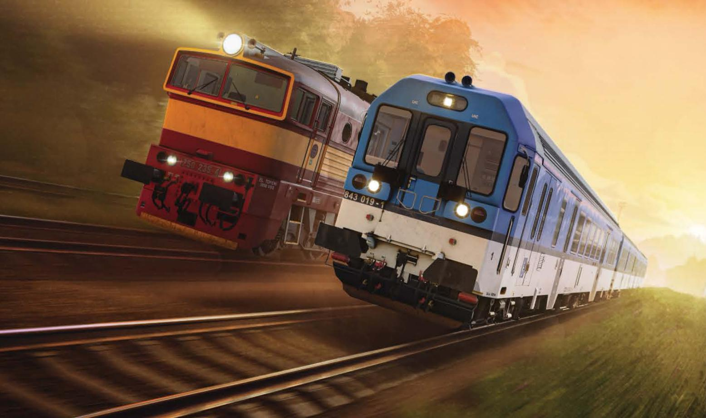

<!-- TOC should be here -->

# **Disclaimers**

- Some shunting services are located in areas without signals. Hidden signals needed to be used there, but those can still cause SPAD. We recommend using the Track Monitor to see those hidden signals and using the TAB (Contact Dispatcher) function in all shunting services.
- Dispatcher calls based on the aspect change of grouped signals is an experimental feature. We haven't found any services where this doesn't work, but we can't 100% ensure that it is working properly at all times. If it doesn't, please let us know the service name.
- Shunting parts of manipulation trains are sometimes longer and have low priority compared to other trains. They may get delayed and let other trains pass through if players take too long with the movements.
- Most of the assets you are going to see here are almost completely new. The majority of foliage assets were created from scratch. We have spent a lot of time optimising the route, but it can still be quite performance-heavy. Please let us know if/when it runs slower than other routes.
- Shuntman navigation is also an experimental feature. It is possible that when reversing to an empty track, the distance being called out may not be 100% the same as the distance remaining to the stopping point. Shuntman always calls out the distance to the nearest stop signal, the wrong junction or the buffers of another vehicle. We had to offset those distances on empty tracks in a bit of a guessing manner.
- We have used event-based weather transitions while playing Squall Line and Mudslide scenarios, so the weather would be exactly the same, no matter how delayed the players are. However, in current builds, the weather fails to change after using the Photo mode.

We have tried to maintain an almost expert-level set of features but for most of our team this is the first experience we had with Unreal Engine, so please let us know how we did and if you'd like us to do something differently the next time. You can let us know either through official DTG channels or on our discord. <https://discord.gg/zTuXCZmRKE>

# **The Route**

# **Route Introduction**

The line features 11 stations and 9 stops. The trains running between Stará Paka and Liberec will both climb and descend 250-300 meters on the 75 km long run. There are 8 tunnels with an overall length of 2421 metres and over 80 bridges and bridge-like structures of various sizes and lengths.

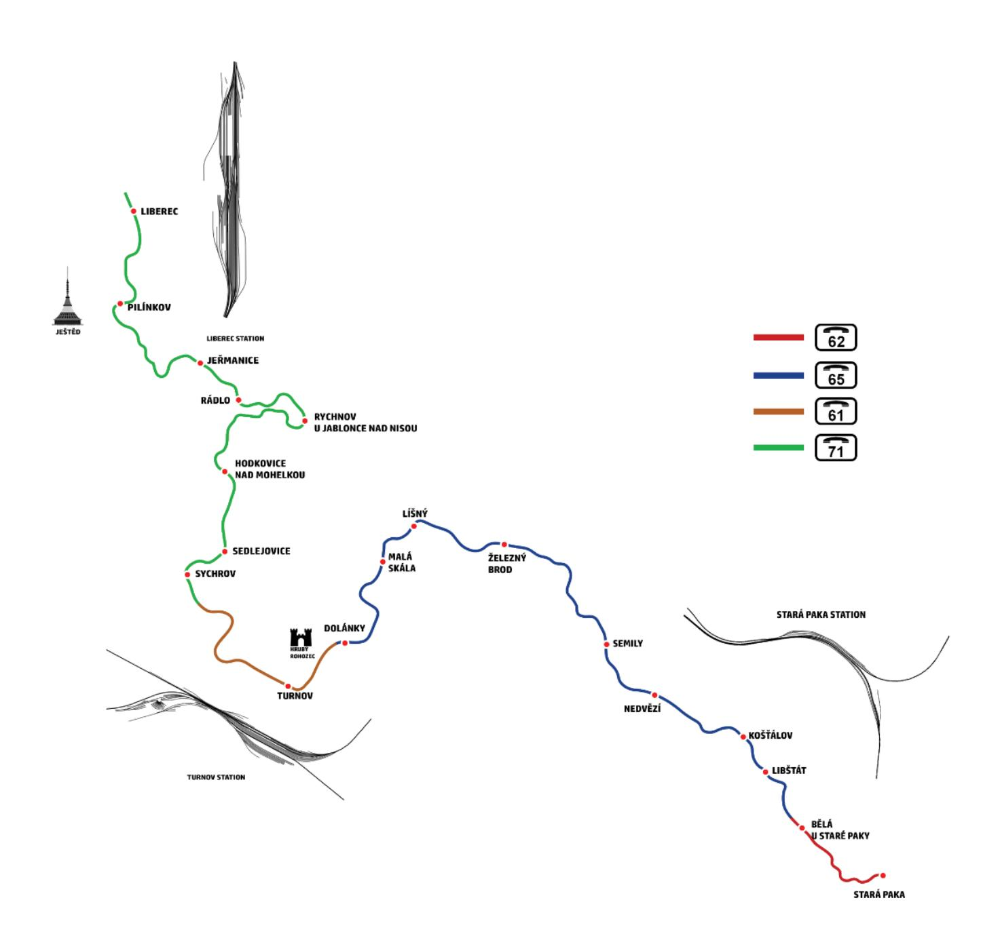

This DLC represents the northwestern half of a single track line connecting the regional capital city Liberec with an Eastern Bohemian conurbation of Hradec Králové and Pardubice. The construction of the route was approved in 1854 and began in 1856. Today, it sounds almost unbelievable, but all major works were done within just three years, and the last part of the route was inaugurated on the 1st of May 1859.

The route starts at the Stará Paka station that sits in the foothills of the Krkonoše mountains. Multiple routes converge in Stará Paka, including one from Chlumec nad Cidlinou to Trutnov (not to be confused with Turnov!) and another to Lomnice nad Popelkou. It then runs along the Oleška creek towards Semily, the smallest county town with just 8,000 inhabitants, but almost 800 years of history. The line here joins the Jizera River, which it will follow all the way to Turnov. The line passes through a narrow canyon with multiple tunnels and galleries between Semily and Železný Brod stations. Another line joins the route, this time being a route to Tanvald, the heart of the Jizera mountains. Fun fact, you can find a miniature model of a railway station right across the station building at Malá Skála!

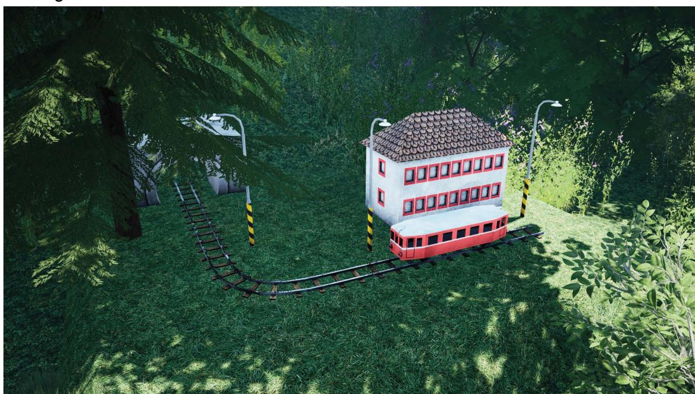

Shortly before reaching Turnov near the Dolánky station, there is the Hrubý Rohozec castle. The castle was founded at the end of the 13th century by Jaroslav z Ralska and his son Havel Ryba z Lemberka from the Markvartici family. It was rebuilt around the year 1600 from a medieval fortress. The landscape briefly opens upon reaching Turnov. Another main line here connects Turnov with Czechia's capital city, Prague. The route then takes a turn and starts to climb towards Sychrov, with its greatest landmark being the Sychrov viaduct, not dissimilar to the Kalte Rinne viaduct on the Semmeringbahn in Austria. The bridge arches 32 metres, roughly the height of

an 11-story building, above the Mohelka river. The line climbs in a narrow valley that also hosts the Prague - Liberec motorway. It briefly leaves the motorway after the Hodkovice nad Mohelkou station and makes a short detour to the Rychnov u Jablonce nad Nisou station that features another interesting viaduct. After a few kilometers it then again joins the motorway, almost at the same spot where it left, but several dozens of metres higher. Now follows Jeřmanice station, the highest point of this line, and a quick descent into Liberec. You can find a lot of [interesting](https://www.vlakregion.cz/trate/030/030.html) facts about this line on this site - Trať 030 Jaroměř - Stará Paka - Turnov - Liberec

# **Tutorials**

### **Route Introduction**

Explore the Liberec station, learn what the collectables look like and hop on the train departing Liberec.

### **Class 750 Introduction**

Learn the basic operations of Class 750 - how to do the cold start, how the brakes are operated and the very basics of driving.

### **Class 750 Walkaround**

Explore the Class 750 in depth - look at what you can control on the outside, what the engine room looks like, what can be controlled there, and how to properly turn on the LVZ safety system.

### **Class 750 Banking Operations**

Learn how the banking operations on Class 750 work.

### **Class 843 Introduction**

Learn the basic operations of Class 843 - how to do the cold start, how the brakes are operated and the very basics of driving.

### **Class 843 Walkaround**

Explore the Class 843 in depth - look at what you can control on the outside and where some of the useful controls are located throughout the train.

# **Scenarios**

# **Class 843**

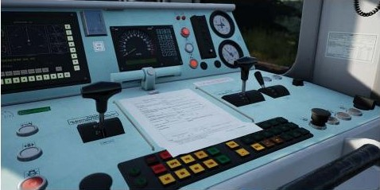

**Squall Line** *(110 min) 3/5*

Clear skies, clear tracks, what could go wrong?

### **Swimsuit Weather** *(120 min) 3/5*

Battle the summer heatwave with overheating 843.

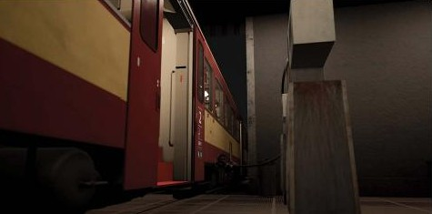

**End of day** *(50 min) 2/5*

Drive the last train of the day to Liberec.

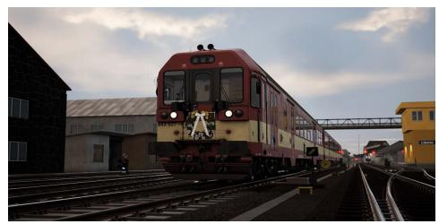

### **Goodbye** *(90 min) 1/5*

Last day of regular service of Class 843 trains around Liberec. Enjoy your ride!

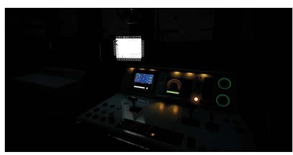

#### **Can You Fix It** *(75-? min) 5/5*

A Class 843 has broken down in Turnov. Can you fix it and drive it to Liberec for maintenance?

# **Class 750**

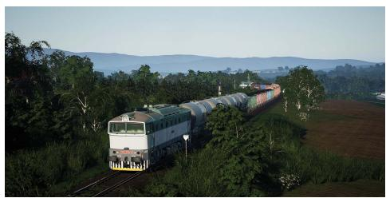

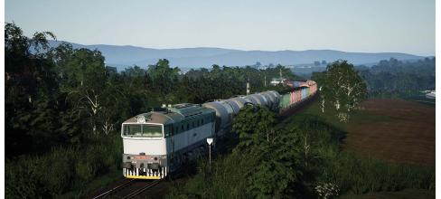

**A Bit Of Shunting - part 1** *(50 min) 3/5* Couple some freight wagons together before driving to Turnov.

**A Bit Of Shunting - part 2** *(40 min) 3/5* Drive the coupled freight train from Liberec to Turnov. *Banking operations will be utilised in this scenario.*

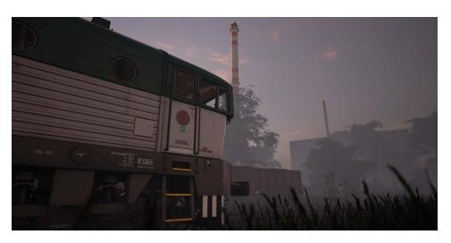

**From Factory To Factory** *(60 min) 3/5* Help supply some local factories in Liberec

with new goods and take out the empty wagons.

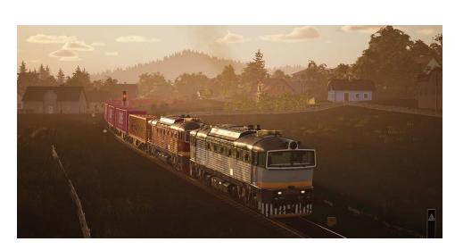

**Mudslide** *(90 min) 3/5*

A mudslide in Bad Schandau caused many diversions of cross-border traffic. *Banking operations will be utilised in this scenario.*

# **Scenario Features**

### **Dispatcher Orders**

You will be issued two paper dispatcher orders in the Squall Line scenario. You

can find their translations at the end of the manual. Once there is more than one paper, it is possible to click on them to cycle through which one would be displayed.

### **Radio Communication**

Same as in real life, shunting movements

have to be communicated with the dispatcher and/or signalers. All shunting movements in scenarios are accommodated with authentic voice recordings in Czech.

### **Shuntman Navigation**

How do you know where you are reversing to and what is behind the train? That's right, you don't! While reversing in scenarios, you would hear a shuntman calling out remaining distances through the radio and navigating you this way to the stopping point. Due to some in-game limitations, this feature is active only in scenarios and not in timetable services.

#### **Banking Operations**

Two of the included scenarios have banking operations in them. Learn and utilise those, they will help you a lot!

#### **Level Crossing Failures**

The Squall Line scenario includes multiple level crossing failures in the coming storm. In such cases, train drivers are mandated to repeatedly use the horn 250 meters from the failed crossing and not exceed 10 km/h speed at a distance of 60 meters or less. Drivers can then gain speed once the front of the train goes over the failed level crossing.

# **Banking operations**

Sometimes one or two locomotives at the front may not be enough. In that case, banking locomotives become quite handy. Unlike most previously seen banking services, the locomotives here don't simply mirror what the player is doing at the front. The banking locomotives here become semi-automatic, and you can control them by audible signals - either by horn or whistle. The signals are either simple or multiple honks combined - short or long. Short signal is any audible signal shorter than 0.5 second; long signals need to be longer than 0.5 second. The banking locomotives look for all track speeds, so they shouldn't push the train above the current limit, but the banking job can be quite difficult, so sometimes they may start to reduce their power quite late. They will also drop all power if the brake pipe pressure drops down and the train starts to brake, but it is best practice to notice them before, so they won't be pushing the gradually braking train.

List of audible commands:

- **- ..** *(1x long, 2x short)* Tells the banking locomotives to apply all available power
- **- .** *(1x long, 1x short)* Tells the banking locomotives to apply half power
- **.** *(1x short)* Tells the banking locomotives to reduce power (full->half or half->off)
- **…***(3x short)* Tells the banking locomotives to cut all power

# **Other route features**

# **Dispatcher calls from group signals**

Some signals on this route are group signals. This means that one signal controls multiple tracks - e.g. signal **S2-8** would apply to tracks 2, 4, 6 and 8. In this case, the driver doesn't have any exact way of telling if the signal applies to their train. The dispatcher is then required to call the train and say an exactly phrased sentence to dispatch that train. In reality, that sentence would be something like "*Train 62401 in Turnov from track 10 to Sychrov, depart!*" However, due to in-game limitations of the subtitle system, this is only shortened to "*You can now depart from Turnov.*" We would like to improve this system in the future, because we believe that the proper depiction of radio calls should be a standard in train simulation games.

It is possible that the system would sometimes also call shunting moves, which it shouldn't.

Please also note that not all trains departing from the Turnov station will get those calls, as some of the signals there aren't group signals. This feature can be seen in **Turnov** and in **Rychnov u Jablonce nad Nisou** stations. It is necessary to have the radio turned on and have the proper channel set. Press the phone in the cabin to accept the call.

# **Enhanced night visuals**

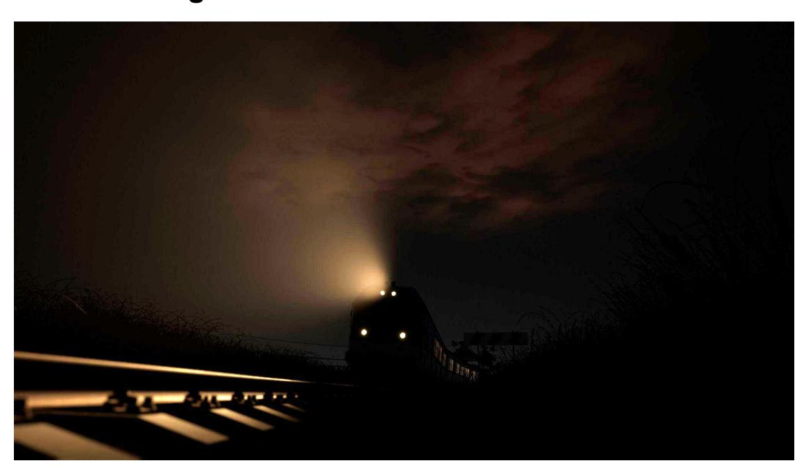

Lights from big cities illuminate the clouds above them.

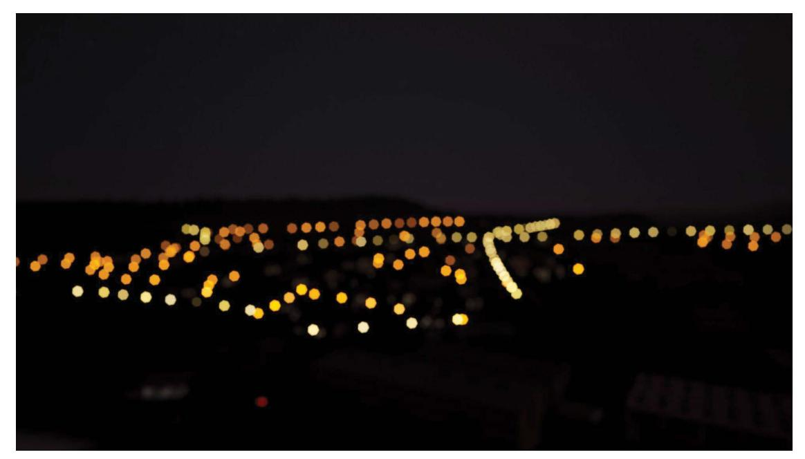

Lamps are visible from big distances.

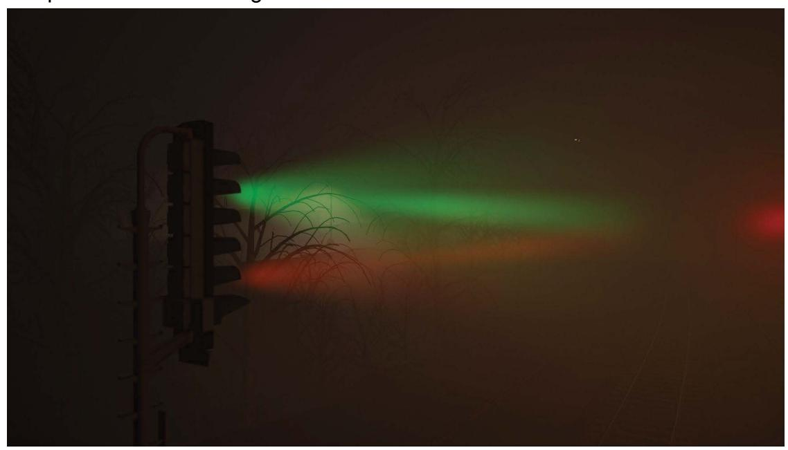

Signals illuminate the fog and near objects.

# **Random deers**

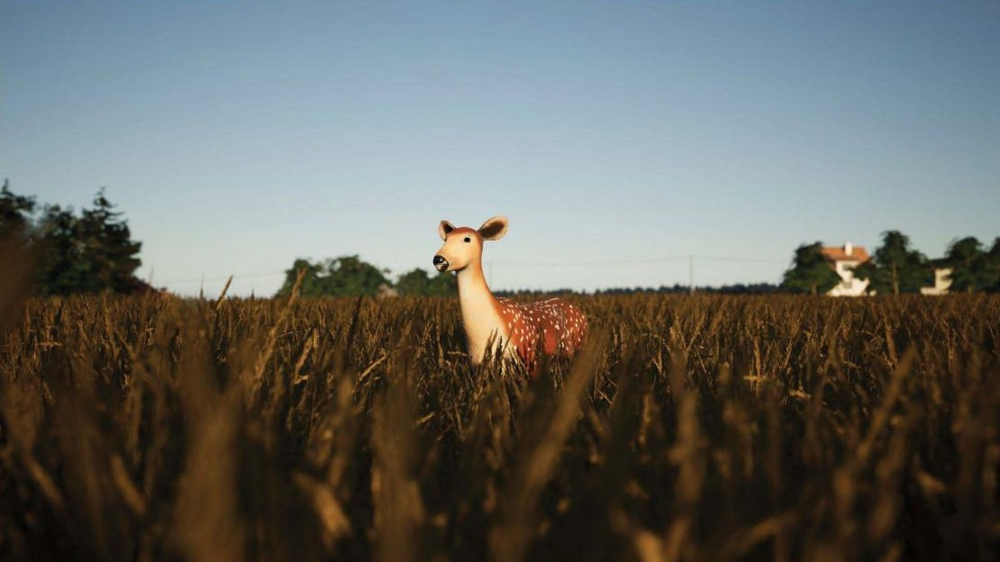

Deers sometimes spawn randomly around the tracks. They are quite hard to spot, but they are there. :)

# **Area fog**

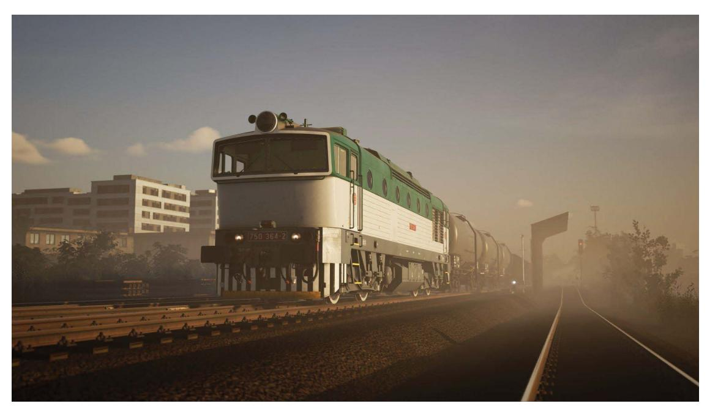

The *From Factory To Factory* scenario uses an experimental feature with volumetric fog only in some areas. We wanted to include this feature in all timetable services, however it was based on randomness and weather settings. Images from the development phase below illustrate how it looked. Please let us know if you would like to see this type of fog used more.

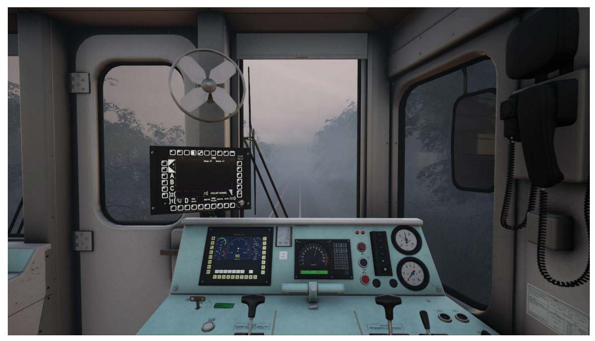

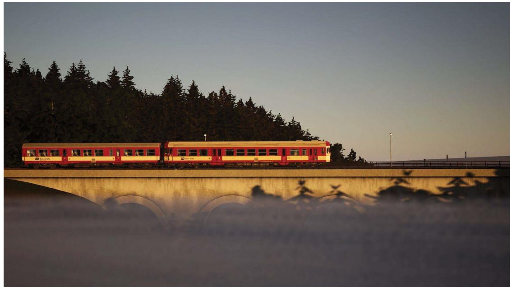

# **Train braking report**

The class 750 allows you to generate a train braking report. This document tells the driver how many vehicles the train has, how long and heavy it is and some more details. It is possible to hide and regenerate the report by clicking on it.

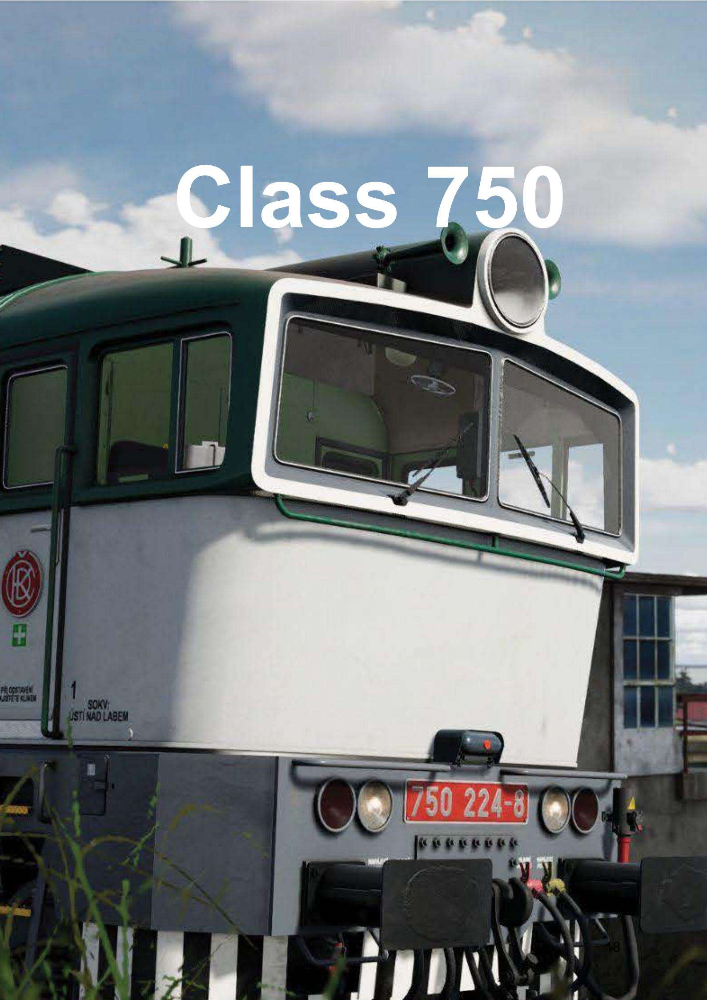

# **About class 750**

# **Brief history**

The class 750 locomotive is a diesel locomotive with electric power transmission, which was created by modernising the 753 series locomotives. After the transition from steam traction to modern traction on Czechoslovak railways, the steam heating of passenger cars, which had been common until then, was discontinued, and trains pulled by diesel locomotives were to be heated electrically from then on. The essence of the reconstruction of the 753 series was the replacement of the steam generator with a heating alternator so that these locomotives could continue to be used for passenger transport. In a similar way, the 751 series locomotives were later converted to the 749 series. Currently, most of the locomotives of this series have been withdrawn from passenger transport; some machines are used in freight transport or by private carriers.

Mainly due to the cancellation of deliveries of a further series of 754 locomotives, at the end of the 1980s, the Czechoslovak State Railways (ČSD) began to feel a shortage of powerful mainline locomotives with electric heating. Since the 1980s, a plan had been implemented to gradually phase out outdated and uneconomical steam heating, and so coaches of that kind were gradually taken out of service and replaced with more modern ones with electric heating. Around 1990, after large deliveries of new Bymee series cars with electric heating, this situation reached the point where there was nothing to pull the entire sets of new cars, as practically the only series suitable for their transport was the 754 series, of which only 86 units were manufactured, which was not enough. The first to decide to address the situation was the depot in Zvolen, where, in 1991, without permission from ČSD management, the conversion of locomotive 753.153 to electric heating was begun. After its successful completion, the relevant components were designed in cooperation with ČKD, and mass reconstructions began in a number of other depots. Individual machines were not selected for modernisation systematically and were given their original serial numbers, so the designation of 750 locomotives does not form a continuous numerical series. By 1995, a total of 163 locomotives had undergone modernisation in this way. The two original prototypes of the 754 series were then added to the 750 series, mainly due to their significant differences from the series machines, and were given the designations 750.409 and 410.

[https://cs.wikipedia.org/wiki/Lokomotiva\\_750](https://cs.wikipedia.org/wiki/Lokomotiva_750)

# **Technical specifications**

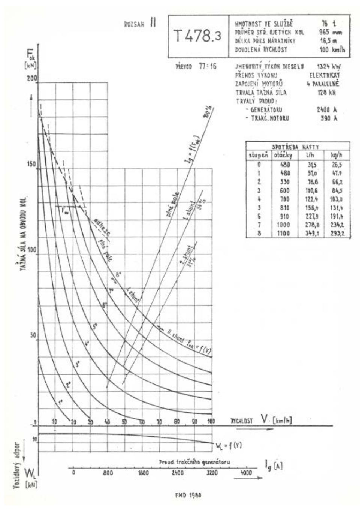

**Manufacturer:** ČKD

**Modernisation years:** 1991-95

**Total count:** 165 **Service weight:** 74 t

**Length over buffers:** 16.5 m

**Power:** 1 325 kW

**Maximum force:** 215 kN **Maximum speed:** 100 km/h **Engine type:** ČKD K12V230DR **Axle gearbox ratio:** 77:16

# **Present class numbers and liveries**

| 750          | Red                             | 750          | Corporate                       |
|--------------|---------------------------------|--------------|---------------------------------|
| 098-6        | yellow                          | 252-9        | blue/Green                      |
| 750          | Red                             | 750          | Green                           |
| 104-2        | yellow                          | 258-6        | yellow                          |
| 750          | Green                           | 750          | Green                           |
| 116-6        |                                 | 259-4        | yellow/Green                    |
| 750          | Green                           | 750          | Corporate                       |
| 121-6        |                                 | 287-5        | blue                            |
| 750          | Red                             | 750          | Green                           |
| 135-6        | yellow                          | 288-3        | yellow                          |
| 750          | Red                             | 750          | Red                             |
| 139-8        | yellow                          | 302-2        | yellow                          |
| 750 163-8 | Corporate blue/Red yellow | 750 314-7 | Red yellow Star           |
| 750 175-2 | Red yellow                   | 750 326-1 | Corporate blue/Red yellow |
| 750          | Red                             | 750          | Red                             |
| 176-0        | yellow                          | 335-7        | yellow                          |
| 750 210-7 | Red yellow Star           | 750 338-6 | Red yellow                   |
| 750 214-9 | Red yellow Star           | 750 349-3 | Red yellow                   |
| 750          | Green                           | 750          | Green                           |
| 218-0        | yellow                          | 364-2        |                                 |
| 750          | Green                           | 750          | Red                             |
| 224-8        |                                 | 368-3        | yellow                          |
| 750          | Red                             | 750          | Red                             |
| 235-4        | yellow                          | 380-8        | yellow                          |
| 750 240-4 | Red yellow                   |              |                                 |

# **Controls**

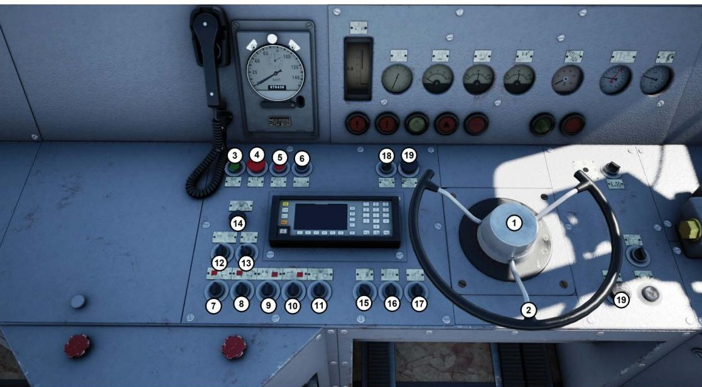

- 1. Reverser
- 2. Throttle
- 3. Start button
- 4. Stop button
- 5. Remote stop button
- 6. Buzzer button
- 7. Signal light back left
- 8. Signal light back right
- 9. Signal light front left
- 10. Signal light front right

- 11. Headlight
- 12. Cabin light
- 13. Instrument lights
- 14. Instrument lights rheostat
- 15. Wipers
- 16. Cabin heating
- 17. Cabin ventilators
- 18. LVZ frequency
- 19. Vigilance button

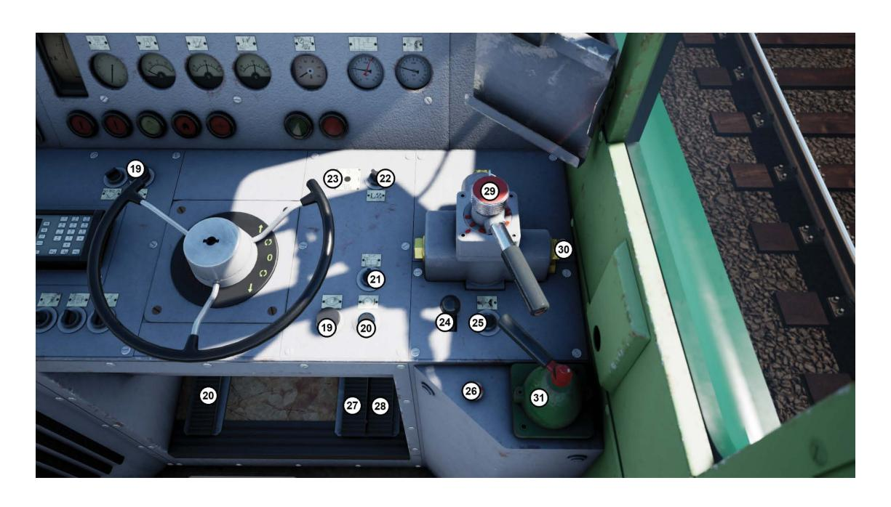

- 20. Sander
- 21. Desk lamp
- 22. Train heating mode
- 23. Train heating
- 24. Brake cylinders release
- 25. Brake bail-off
- 26. Whistle

- 27. Horn low
- 28. Horn high
- 29. BS2 train brake
- 30. Train brake overcharge
- 31. BP1 loco brake

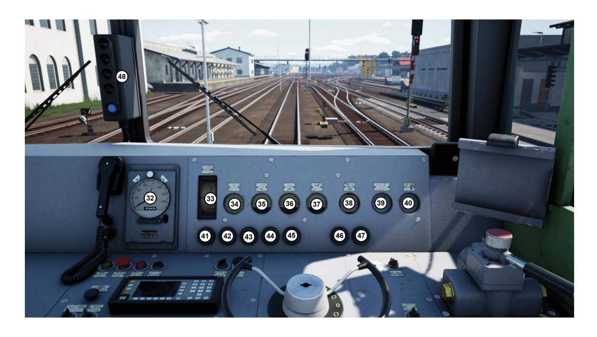

- 32. Speedometer
- 33. Traction ammeter
- 34. RPM
- 35. Oil pressure
- 36. Oil temperature
- 37. Water temperature
- 38. Train heating current
- 39. Train brake manometer
- 40. Brake cylinders

#### manometer

41. Failure indicator

- 42. Failure of a remotely controlled loco indicator
- 43. Wheelslip indicator
- 44. Fire indicator
- 45. Charging failure indicator
- 46. Train heating active indicator
- 47. Train heating failure indicator
- 48. LVZ cab signal

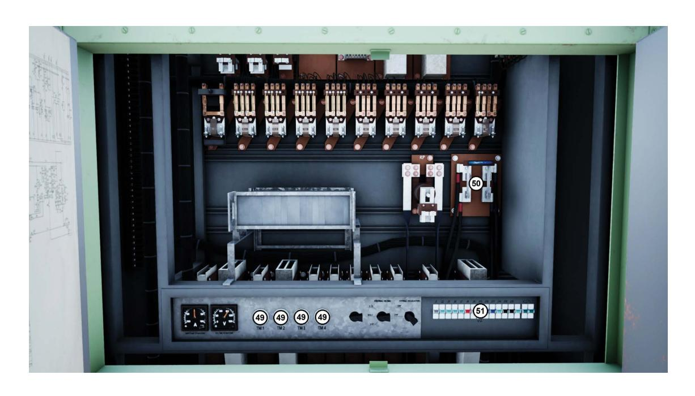

49. Traction engines isolation switches

- 50. Battery handle
- 51. Circuit breakers

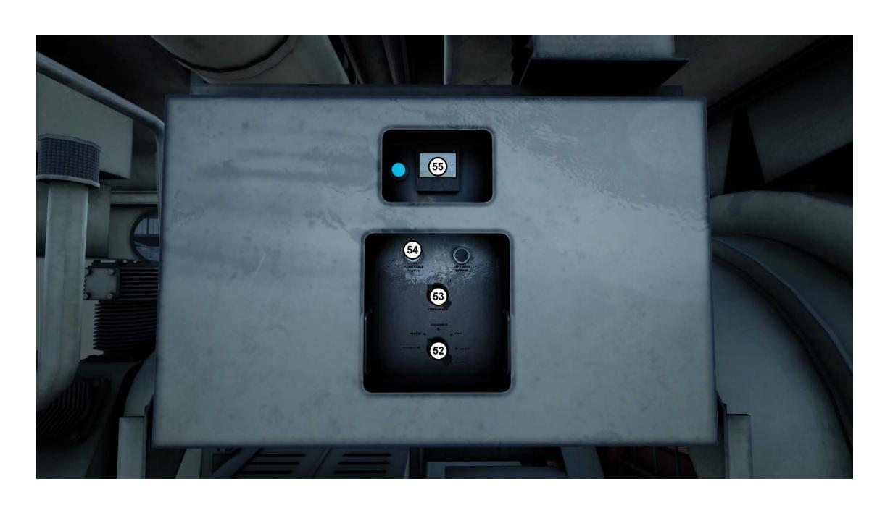

- 52. LVZ mode
- 53. LVZ active cab

- 54. LVZ start control light
- 55. LVZ voltmeter

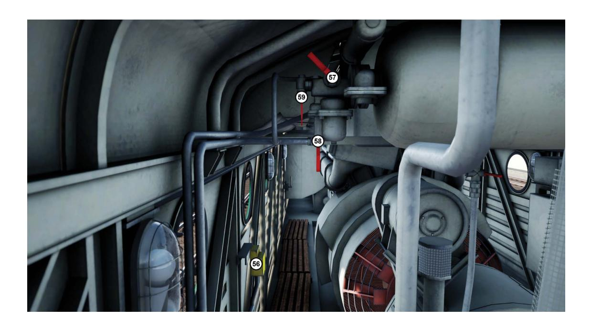

56. Safety system and radio air valve

57. Brake mode G/P

- 58. Distributor cutoff valve
- 59. Distributor release valve

## **Cold&Dark Start**

- 1. Climb up the cab
- 2. Walk into the engine room
- 3. Check oil sticks in the engine and compressor
- 4. Check that the yellow safety system valve is closed
- 5. Open the doors to the electric compartment
- 6. Check that J15 and RDST circuit breakers are turned off
- 7. Turn on the electric power by moving the battery handle
- 8. Insert the reverser in one of the cabins
- 9. Move the reverser to the Engine-Only position, which is either the first forward or the first backward positions
- 10. Hold the engine start button until the engine starts. You should hear the sound of the engine primer. If the engine is cold (water temperature < 40°C), the priming can take up to 60 seconds. Hold the button until the engine reaches idle revs of 480 rpm. After starting, the engine should be allowed to heat up at idle RPM to at least 25°C - water temperature.
- 11. Turn on J15 and RDST circuit breakers
- 12. Set the LVZ mode switch to the Shunting position
- 13. Open the yellow safety system valve in the engine room
- 14. Let the compressor fill the main reservoir. You can speed up the compressor by increasing the current power notch with the Throttle, but the reverser has to be in the engine-only position.

# **Changeover**

- 1. Insert the reverser, and set it into the desired direction
- 2. Unlock the BS2 train brake with the key
- 3. Make a full BP1 loco brake application
- 4. Release the train brake
- 5. Turn the radio and signal lights on
- 6. If using the LVZ safety system
- a. Check that the loco brake is fully applied
- b. Check that the J15 circuit breaker is turned on
- c. Check that the yellow safety system valve is opened
- d. Set the LVZ mode switch to the Start position and wait for the start indicator to light up
- e. Once the white start indicator light is on, set the LVZ mode switch to the Active position
- 7. Release both hand brakes if cold starting

## **Cab change**

- 1. Stop the train or shunting set
- 2. Set the reverser to the neutral
- 3. Lower the train pipe pressure using the BS2 enough to hold the loco safely. You may or may not use the emergency brake position.
- 4. Move the BS2 lever to the cut-out position.
- 5. Lock the BS2 lever using the key.
- 6. Release the loco brake.
- 7. Check that the loco brake is released.
- 8. If you have signal lights switched on from this cab, and you are moving to the other cab for a longer time, turn them off here.
- 9. Check that the loco brake is released.
- 10. Turn the lights off, set the heating and ventilator as desired.
- 11. Check that the loco brake is released.
- 12. If you intend to use the LVZ, go to the LVZ panel and switch the cab to the new cab.
- 13. Go to the new driving cab. Sit down.
- 14. Unlock the BS2.
- 15. Set the loco brake and release the BS2.
- 16. Insert the direction lever and move it to the desired position.
- 17. Press the Power button on the TRS/GSM-R radio. Wait for it to start and check the correct channel.
- 18. Set gauge lighting accordingly.
- 19. Set signal lights accordingly.
- 20. Release the brakes and see that nothing has changed. Now go to the other cab and finally release the loco brake. (Apply any brake to hold the train while you do so.)

## **LS IV type LVZ**

- LVZ stands for Continuous transmission train protection system. On both the 750 class, the LS IV on-board unit is installed.
- It reads and displays the simplified next signal aspect information that has been transmitted by the LS trackside equipment.
- The trackside equipment is almost exclusive to double-track electrified mainlines with the automatic block signalling system. On unequipped lines, the LSIV LVZ system acts as a vigilance control device only.
- The LS low-bandwidth signal aspect transmission works by rhythmical interruptions of a carrier frequency in track circuits or in code transmission loops.
- Originally, it used 50Hz, but later, a 75Hz frequency was added for usage on AC 50 Hz electrified lines. In more recent times, the 75 Hz frequency is used only because the 50 Hz frequency is very prone to 50 Hz interference, mainly from, but not exclusively from, high to very high voltage lines.
- The blue light tells the driver that a vigilance check isn't currently needed. After the light turns off, a siren would activate after some time. If the vigilance is still not confirmed, then emergency braking is applied. Timings are as follows:
- 4 seconds with the light on
- 7 seconds with the light off
- 5 seconds with the siren on
- If the LVZ applies emergency braking, the only way to reset it is to go to the control console (in the engine room for Class 750) and turn the safety system off and back on.

# **BS2 Train Brake**

- 1. Quick-release notch
- a. Uses the full main reservoir pressure to fill the brake pipe

**WARNING**: **It can and often will cause the brake pipe to be filled to the same pressure as the main reservoir, causing brakes to be uncontrollable!**

- 2. Release notch
- a. Maintains the released pressure of 5 bar in the brake pipe. This is your driving notch.
- 3. Neutral notch
- a. Same as the brake cut-out notch, but can't be locked in this position.
- 4. Braking notches
- a. A set of self-lapped notches allowing gradual pressure control down to 3 bar.

- 5. Brake cut-out notch
- a. Neutral notch, the only notch where the brake lever can be locked and unlocked.
- 6. Emergency braking notch

### **TRS/GSM-R Train Radio**

Class 750 is equipped with a TRS/GSM-R radio. This enables the drivers to stay in touch with dispatchers both under the GSM-R system and the older analogue TRS system.

The GSM-R system is straightforward; the driver registers the new train number into the GSM-R system, and the train becomes reachable by calling its train number.

The TRS system uses radio channels, similar to how walkie-talkies work. The driver would be advised by trackside signage to change the radio channel once the train reaches the border between the two areas.

The simplex system should be used while shunting. This enables everyone on the channel to hear anybody else talking without the need to call them.

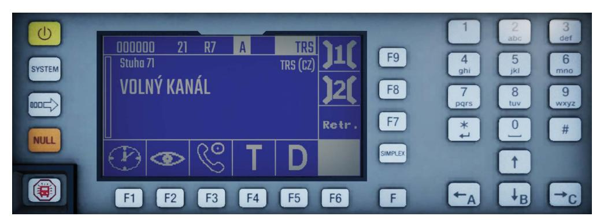

a) Base screen with TRS system. The train number appears in the left corner (000000), Stuha 71 means that the current set channel is 71. The VOLNÝ KANÁL message tells the driver that the channel is currently free. It will change to KANÁL OBSAZEN when someone is talking on the channel. NENÍ NOSNÁ will be displayed if the base radio tower is unreachable, either in tunnels or places without signal, or if the set channel doesn't correspond to the channel used in the current area.

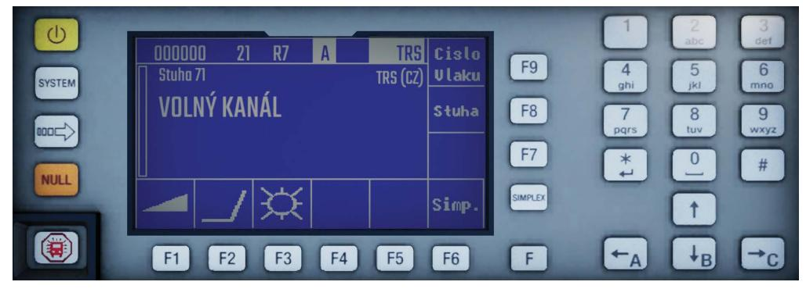

- b) On the F button press, an options menu appears.
- i)Press F3 to change the display brightness
- ii)Press F6 to change the current simplex channel used
- iii)Press F8 to change the current TRS channel used
- iv)Press F9 to change the current train number set

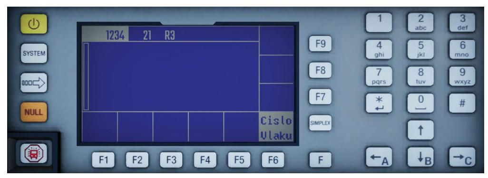

c) On the F9 button press, the driver can change the train number on the keypad to the right. Press \* to confirm the number or # to remove the last number. Press NULL to cancel.

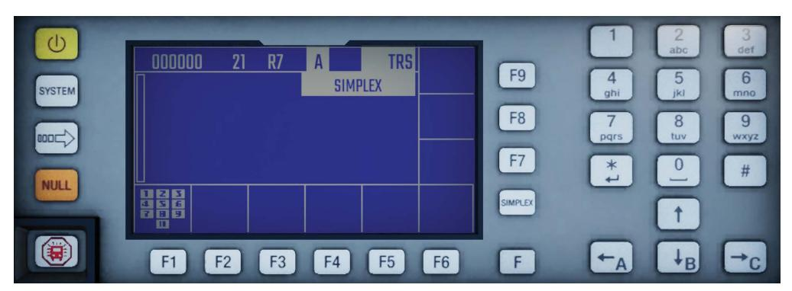

d) A simplex system is currently used and displayed in the upper part of the display.

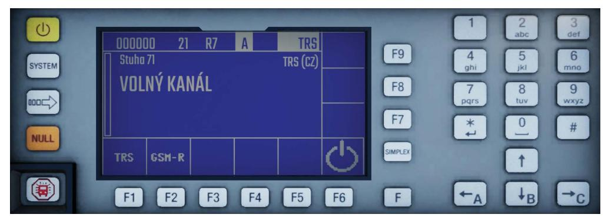

e) On the SYSTEM button press, a menu allowing the driver to select between the TRS and GSM-R systems appears.

The arrow on the left allows a quick channel change - either of the TRS channel or the simplex channel if simplex is currently active.

The radio should be correctly set up after loading into the game, but the channels need to be changed while driving if needed.

## **Driving notes**

- Wait on the 1st notch when powering down until the traction current drops. Failure to do so would cause the driving contactors to arc and gradually burn down.
- Always check that the BS2 train brake lever isn't left in the Quick Release position, as this would cause the train to overcharge its brakes and may render them unusable.
- Check oil and water temperatures. If the temperatures are too high and idle cooling itself isn't enough, you can enhance the cooling by moving the reverser to the Engine-Only notch and setting the engine to around 4th-5th notch, as that would cause the ventilators to spin faster. The ventilators also spin faster if the engine is in power while the train is going, but in Engine Only it won't burn down as much fuel and create as much heat, so the cooling will be faster.
- While releasing the train brakes, it can be helpful to overcharge them a bit. This can be done either by moving the BS2 handle to Quick Release for a fraction of a second and back to Release again, or by holding the Linear Overcharge button. This will cause the brake pipe pressure to gradually rise up to 5.4 bar while holding it down and then slowly fall back to 5 bar.
- The safety system electro-pneumatic valve checks that both the radio and the LVZ safety system are powered. If either of those two would lose power - either by switching off the central electrical power from batteries, by turning off their circuit breakers or by turning the LVZ mode switch to the off position - the valve would open. In that case, the driver has to close the yellow safety system valve located in the engine room.
- Try moving the Throttle back and forth between the 0th and 1st notches if it does not apply power for any obvious reason. Necessary conditions to allow power to be applied are a set reverser, brake pipe pressure being greater than 3 bar, and obviously, the engine must be running.

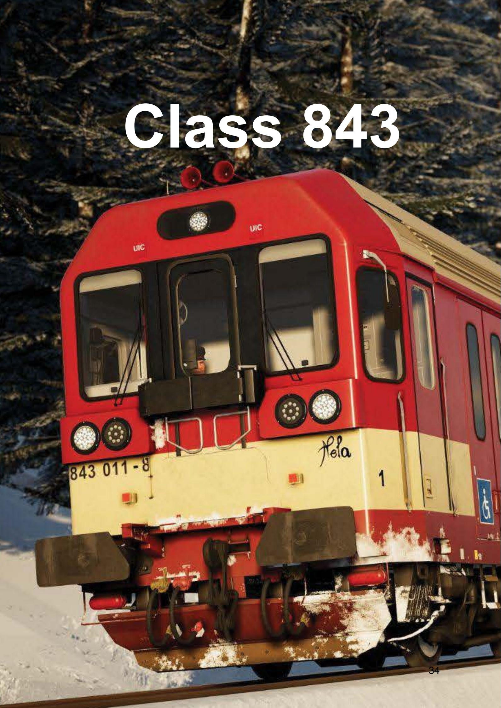

# **About class 843**

# **Brief history**

The 843 series railcars are Czech railway railcars manufactured in the late 1990s by Moravskoslezská vagónka a. s. (now Škoda Vagonka). They are used for passenger trains, express trains, and fast trains. All 843 series railcars have been owned and operated by České dráhy since the beginning of their service. The first seven 843 series railcars were delivered to České dráhy in January and February 1997. These first units were assigned to the Šumperk, Chomutov, and Děčín depots. As with every new series of vehicles, the introduction of the 843 railcars into service was accompanied by defects. A serious situation arose in January 1998 when pitting was discovered on the running surface of the wheelset on car 843.024. The same defect subsequently occurred on the wheelsets of other coaches, and therefore, on April 16, 1998, the entire 843 series, including the 043 trailer cars and 943 control cars, was taken out of service by decision of the Railway Authority. The wheelsets were subsequently replaced with new ones with higher strength and hardness, and it was not until July 1999 that the cars were gradually put back into service. The cars also exhibit a higher failure rate of combustion engines, but this is due to their heavy operational load, as they often run at the limits of their performance capabilities. Faults in the control electronics are also relatively common. On the other hand, the cars have excellent traction characteristics, a relatively modern control system, and a comfortable interior.

Until 2020, all 843 coaches were stationed in Olomouc and Liberec. In both locations, they provided connections for passenger trains, express trains, and fast trains. In 2021, eight cars (one of them on loan in Liberec) were relocated from Liberec to Trutnov. However, at the end of the 2020/2021 timetable, all remaining Liberec cars except for two were relocated from Liberec to Trutnov, joined by two former Liberec cars from Olomouc. After 2021, there were no longer any in Liberec. 18 cars were in Trutnov and 13 in Olomouc. In 2024, several cars were moved from the Hradec Králové Region to the South Moravian Region. In the Hradec Králové Region, these cars are gradually being replaced by 847 motor units.

[https://cs.wikipedia.org/wiki/Motorový\\_vůz\\_843](https://cs.wikipedia.org/wiki/Motorov%C3%BD_v%C5%AFz_843)

# **Technical specifications**

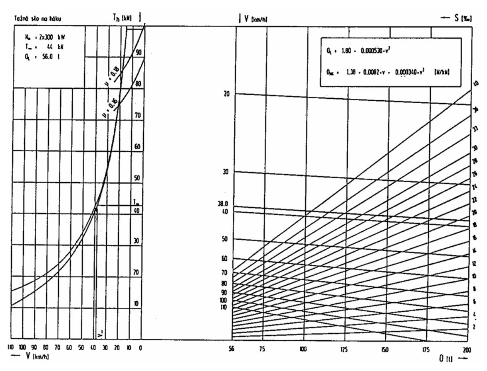

**Manufacturer:** Moravskoslezská vagónka

**Manufacturing years:** 1995-97

**Total count:** 31 **Service weight:** 56 t

**Length over buffers:** 25.2 m

**Power:** 600 kW

**Maximum force:** 100 kN

**Construction speed:** 120 km/h **Maximum speed:** 110 km/h

**Engine type:** 2x LIAZ M 1.2 C ML 640 D

**Seat count:** 54

# **Present class numbers and liveries**

| N1                    | 843 017-5 | Red |
|-----------------------|--------------|-----|
| Red                   | 843 018-3 | N1  |
| N1                    | 843 019-1 | N1  |
| N1                    | 843 020-9 | N2  |
| N2                    | 843 021-7 | N2  |
| N1                    | 843 022-5 | Red |
| N1 "Amálka"        | 843 023-3 | N1  |
| Red                   | 843 024-1 | N2  |
| N1 LED "Bobík"  | 843 025-8 | N1  |
| Red LED            | 843 026-6 | N2  |
| Red LED "Nela"  | 843 027-4 | Red |
| N1                    | 843 028-2 | N2  |
| N1                    | 843 029-0 | N1  |
| N1 "Koťátko II" | 843 030-8 | N1  |
| N2                    | 843 031-6 | Red |
| N1 LED             |              |     |
|                       |              |     |

# **Controls**

### **Driver's desk**

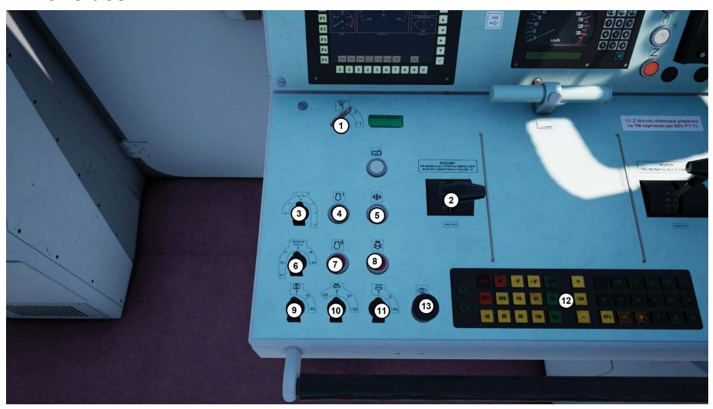

- 1. Master key
- 2. Reverser
- 3. Engine selection
- 4. Engine start
- 5. Engine neutral
- 6. Signal lights selection
- 7. Engine stop

- 8. Engine emergency stop
- 9. Cabin lights
- 10. Wipers
- 11. Headlights
- 12. Cruise control keyboard
- 13. Vigilance button

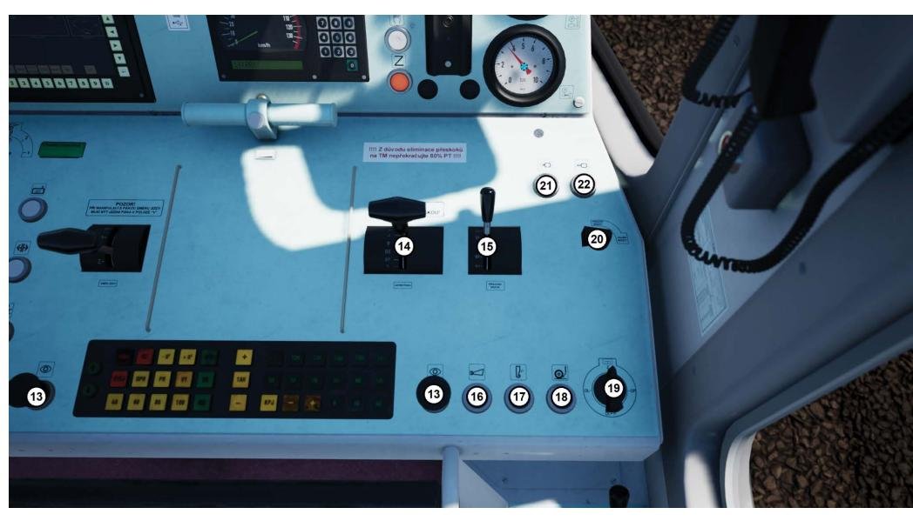

- 14. Throttle and Brake (*HJP*)
- 15. Loco brake (*BPE*)
- 16. Horn
- 17. Whistle
- 18. Sander

- 19. Door locking switch
- 20. Brake cutout
- 21. Brake overcharge
- 22. Brake quick-release

#### **Driver's desk - right console**

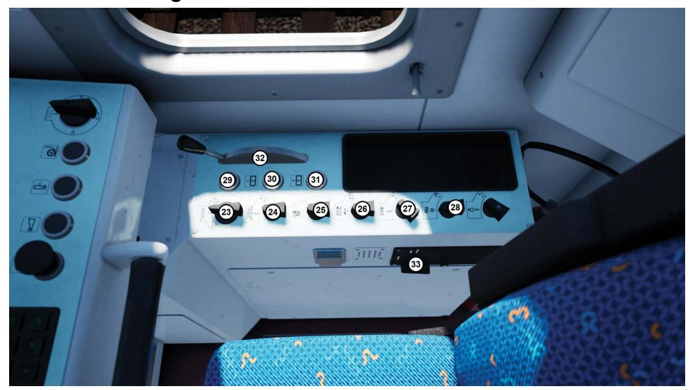

- 23. Mirrors
- 24. Mirrors heating
- 25. Cabin ventilator
- 26. Automatic Speed Control
- 27. Electrodynamic brake
- 28. reserved

- 29. Acknowledge failure
- 30. Train lights on
- 31. Train lights off
- 32. Emergency brake
- 33. LS 90 mode

#### **Driver's desk**

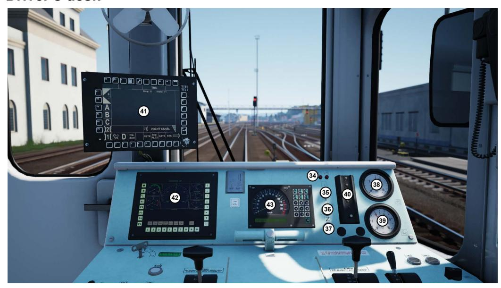

- 34. Tail lights indicator
- 35. Open doors indicator
- 36. Stop on request indicator
- 37. Brake cutout indicator
- 38. Train brake manometer

39. Brake cylinders

#### manometer

- 40. LS90 signal repeater
- 41. TRS/GSM-R radio
- 42. Main display
- 43. Metra Speedometer

### **Cab A back panel**

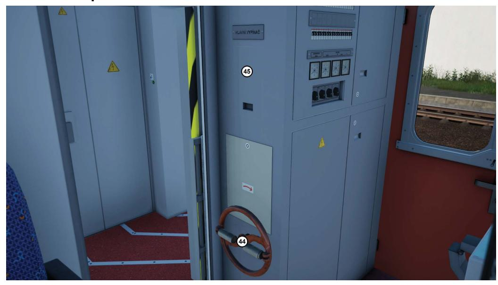

44. Handbrake 45. Battery handle cover

#### **Cab A back panel**

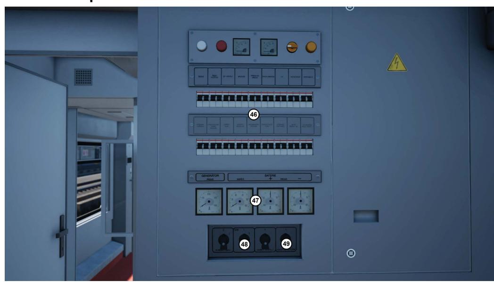

- 46. Cab circuit breakers
- 47. Battery amp and

voltmeters

48. Electrodynamic brake toggle

49. Emergency train lights

### **Regulator (RTR)**

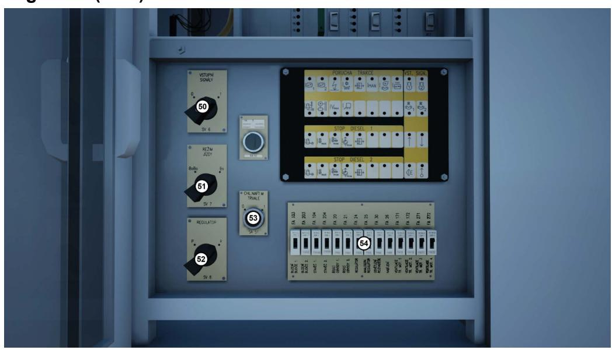

- 50. Regulator input signals
- 51. Bo / BoBo mode
- 52. Regulator backup

- 53. Engine cooling
- 54. Regulator circuit breakers

#### **Air brakes cabinet**

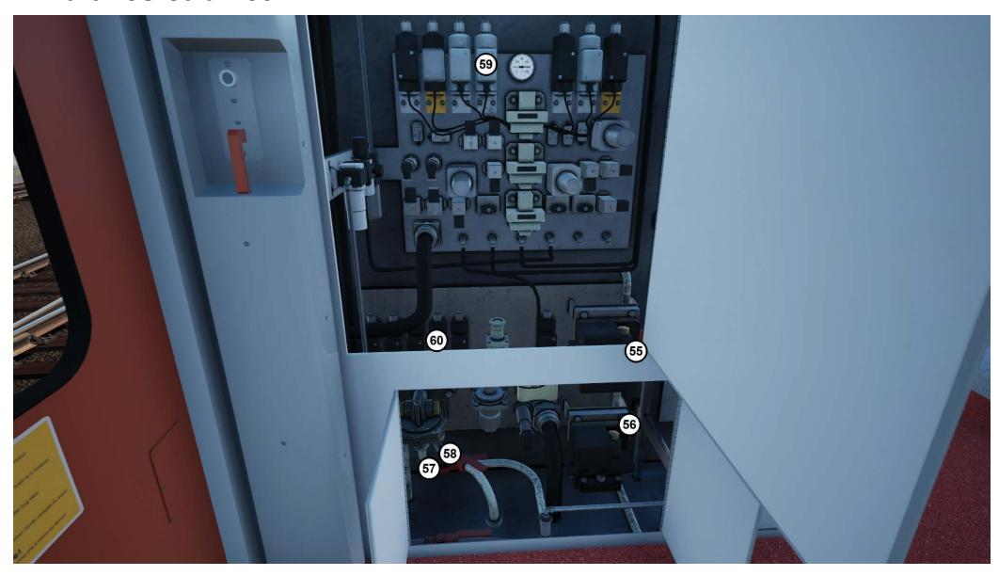

- 55. Bogie 2 air valve
- 56. Bogie 1 air valve
- 57. BSE output valve
- 58. BSE input valve

- 59. Direct brake
- electro-pneumatic valves
- 60. BSE electro-pneumatic

valves

### **Pax comfort panel (RTO)**

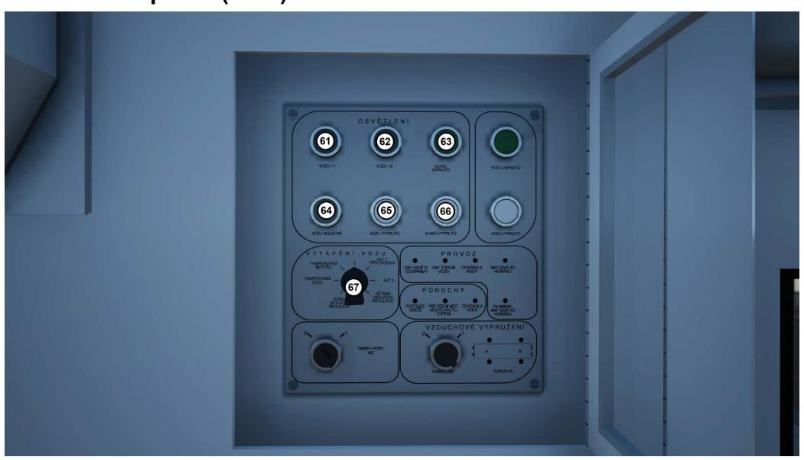

- 61. Loco int. lights full
- 62. Loco int. lights half
- 63. Train lights on
- 64. Loco int. lights emergency
- 65. Loco int. lights off
- 66. Train lights off
- 67. Loco heating mode

# **Cold&Dark Start**

- 1. Open the battery cover and turn the handle to get electrical power.
- 2. Switch the Master Key to the Master position to activate the cab.
- 3. Wait for the displays to boot up.
- 4. Set the reverser to the Engine Only position.
- 5. Set the Engine Selection switch to the 1 (Master) position to the left.
- 6. Hold the Engine Start button until the engine starts.
- 7. Set the Engine Selection switch to the 2 (Master) position to the left.
- 8. Repeat step 6.
- 9. Wait until the main reservoir fills with air.
- 10. Disable the brake cutout with the Brake Cutout switch.
- 11. Set the Throttle and Brake lever to the J position to fill the brake pipe.
- 12. Set the correct signal lights. Use Both White as front lights and also Reduced headlights position if the train has LED lights.
- 13. Turn on the radio and set the correct train number.
- 14. Fully apply the direct brake and turn on the LS90 safety system if needed.
- a. After the direct brake is applied, move the mode switch into the START position. Once the red lights turn green, move the switch to the PROVOZ (Active) position.
- 15. Release the handbrake.

# **Changeover**

- 1. Set the Master key to the Master position to activate the cab.
- 2. Open the VLAK page to acknowledge new consist information
- 3. Set the reverser to the forward position.
- 4. Disable the brake cutout with the Brake Cutout switch.
- 5. Set the Throttle and Brake lever to the J position to fill the brake pipe.
- 6. Check that the signal lights are correct.
- 7. Turn on the radio and set the correct train number.
- 8. Turn on the LS90 safety system if needed.

## **Cab change**

- 1. Apply the loco brake.
- 2. Return all control elements to their default positions.
- 3. Switch the Master key to the 0 (Off) position or to 2 position if you will control the train from a different railcar.
- 4. Release the loco brake.
- 5. Turn off the LS90 safety system if it was used.
- 6. Change ends.
- 7. Switch the Master key to the 1 (Master) position.
- 8. Open the VLAK page to acknowledge new consist information.
- 9. Set up the signal lights.
- 10. Set the reverser in the desired direction.
- 11. Set the Throttle and Brake lever to J position to fill the brake pipe.
- 12. Turn on the LS90 safety system if needed.
- 13. Set the Engine Selection switch to the C (Central) position and press the Engine Start button to give all engines their utrals (as deactivating the master cab will put all engines into neutral).

# **Master key**

Position 0 deactivates the cab.

Position 2 (Slave) tells the regulator to listen for incoming commands from the Master vehicle.

Position 1 (Master) activates the driver cab if there aren't any other active Master cabs detected in the train - in that case, it will display KOL or KOLm failures until the collision is resolved.

# **Reverser, Engine selection switch and engine controls**

Engines can be started only in the Engine Only position. Class 843 has got only one Engine Only position.

The engine selection switch lets the driver decide which engine to control.

The default position is C - this position can not start any engine, but can control whether all engines are in neutral or not. Positions 1 and 2 to the left control engines of the current vehicle, positions 1 and 2 to the right then control engines of any controlled vehicle. Position E is reserved for control of electric trains.

To start an engine, put the reverser to the Engine Only position, select which engine to start using the selection switch and hold the start button until it reaches its idle revs of 700 rpm. Hold the stop button until the engine completely stops while stopping it.

Engines can also be stopped by the emergency shutdown button. This will shut down all engines in the train. However, it is necessary to either turn off and back on the ŘÍZENÍ circuit breaker or turn off and on the battery power to clear this emergency manipulation.

When driving the 843, an abnormal condition or a driver's command can remove the consent for traction for an individual diesel engine. If an engine loses its consent, it is said that it is in "**neutral**". The control software and circuitry, however, work with the "negation of neutral". In the Czech language, the word for "not" is "ne". And according to linguistic rules, double negation is positive and is redundant. So the negation of neutral got its famous name - **Utral**!

If you, for any reason, want to put any engine to neutral, simply select that engine using the engine selection switch and press the neutral button. You may re-engage Utral for an engine by selecting it with the engine selection switch and pressing the Start button. The utral state can be seen on the POHON page as INN value, where \*\* would be displayed if both engines have their utrals.

## **Throttle and Brake lever (HJP)**

This lever allows the driver to comfortably control the motoring, dynamic braking, and pneumatic (automatic) braking with one hand. Its functions differ between the automatic speed control driving and manual driving.

The 843 logic sets motoring and dynamic brake using the "Set Power" metric. You can see the set power parameter displayed in the centre of the main display. Its value can be from -100% through 0 to +100%. Negative values command dynamic braking; positive values command motoring.

### **MAN - Automatic speed control disabled**

- **S** set power gradually increases to +100%; train brake releases.
- **J** positive set power without change; negative set power increases towards 0%; train brake releases.
- **V** positive set power decreases towards 0%; negative set power without change, train brake holds lapped pressure.
- **BE** positive set power flips into negative; negative set power decreases towards -100%; train brake holds lapped pressure.
- **BP** positive set power flips into negative; negative set power continues to decrease towards -100% if the lever has been in BE for more than 1s, otherwise it stays constant; train brake applies linearly.
- **R** brake power set to -100%, emergency braking

### **ARR - Automatic speed control enabled**

- **S** ARR can be motoring\*, dynamic, and pneumatic braking
- **J** ARR can be motoring\*, dynamic, and pneumatic braking
- **V** ARR can be dynamic and pneumatic braking;\*\*
- **BE** sets brake preference active; Works like in MAN control.\*\*
- **BP** sets brake preference active; Works like in MAN control.\*\*
- **R** emergency braking, cancels confirmed driving
- \* In Automatic mode, the J position allows motoring. But the J position also serves to release driver-set braking. To allow for brake release without allowing motoring, there is a function called "driving consent". The ARR cannot command motoring unless the driving consent is active. The driving consent gets disengaged when the lever is moved to V, BE, BP or R. It gets active again when the lever moves to S, or when the driver moves the lever from V to J when there is no driver-requested braking command.
- \*\* There are two sets of dynamic brake commands and pneumatic brake commands. The driver-requested and ARR-requested. The resulting brake command is the greater of the two. When the driver moves the lever to BE or

BP, the driver-requested command jumps to the actually existing resulting command. The driver thus cannot command less braking than the ARR currently uses.

# **Automatic speed control (ARR)**

Class 843 is equipped with an automatic speed control system. This system can be turned on or off with the Automatic Speed Control switch located on the right, below the right side window. The switch has three positions:

- Manual
- Automatic
- Automatic (Winter)

Current speed will be set as the target speed once the system becomes active. To change this speed, simply press any speed key on the Cruise control keyboard.

The **"+"** and **"-"** buttons on the right side of the keyboard change speed by increments of 5 km/h. The **"+"** and **"-"** buttons in the middle column set the positive set power limit by increments of 10%. The system defaults to 80% positive set power limit.

Class 843 was to be equipped with the ATO system, but that had never happened. Instead, the third position enables the "winter" mode, where the train would periodically apply light brakes to keep them warm and rev up the engines to around 1100 rpm if the reverser lever is put in the Engine Only notch.

# **Holding brake**

The holding brake is turned on by default. To release the holding brake:

- MAN Put the Throttle and Brake lever to S notch
- ARR Hold the Throttle and Brake lever in S notch until the train accelerates past 2 km/h.

It is possible to disable the holding brake entirely in the MAN mode. To do this, hold the Throttle and Brake lever in the **BE** notch and press the speed **"-"** button on the Cruise control keyboard. You can activate it again either by putting the Throttle and Brake lever in the **BE** notch and pressing the speed **"+"** button or by simply turning the Automatic speed control on (and back off if you wish). The holding brake is always active if the Automatic speed control is on.

### **Main Display**

### **Home page**

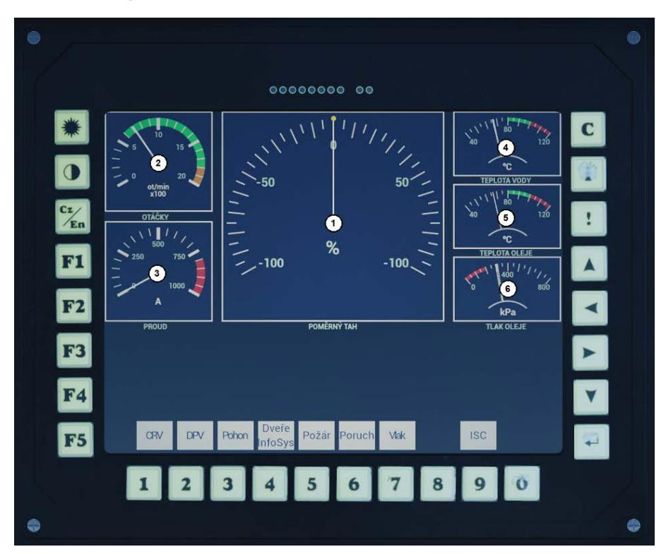

- 1. Set power
- 2. Engine 1, 2 RPM
- 3. Bogie 1,2 current

- 4. Water temperature 1,2
- 5. Oil temperature 1,2
- 6. Oil pressure 1,2

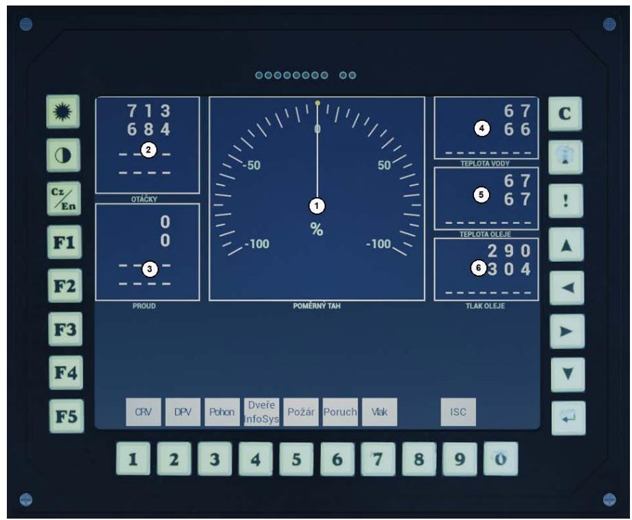

The layout can be toggled by the **"I"** button under the **"C"** button.

**CRV - Central Computer Diagnostics**

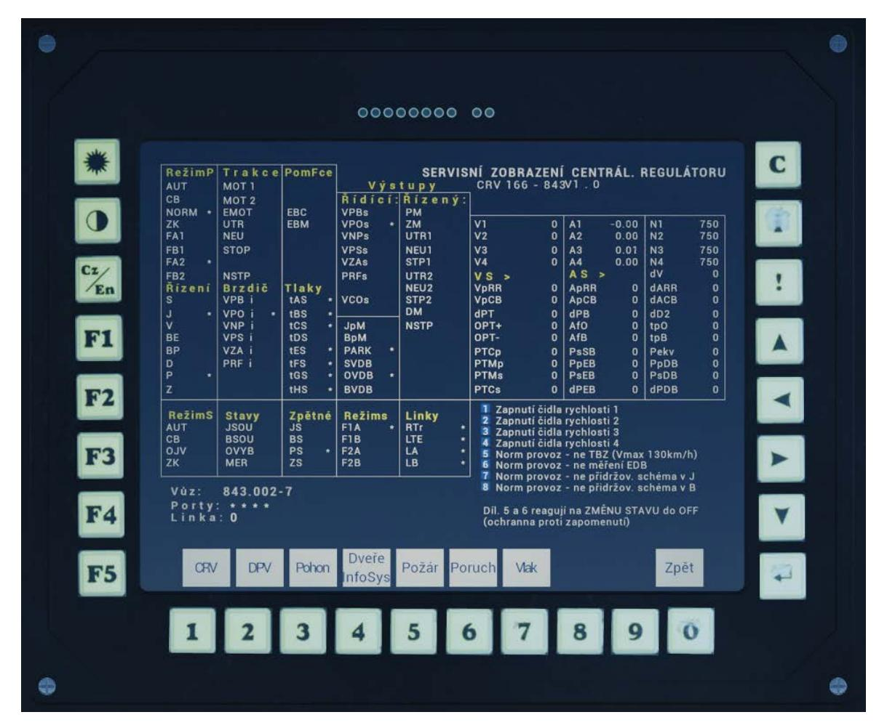

| AUT  | ARR selected           | NSTP | Em. stop pressed          |
|------|------------------------|------|---------------------------|
| CB   | ATO selected           | VPBi | Service braking from HJP  |
| Norm | Manual mode            | VPOi | Service brake release     |
| ZK   | Test mode              | VNPi | Overcharge from button    |
| FA1  | A master key in 1      | VPSi | Quick release from button |
| FB1  | B master key in 1      | VZAi | Brake cutout              |
| FA2  | A master key in 2      | PREi | Brake release preference  |
| FB2  | B master key in 2      | JSOU | Motoring consent          |
| S    | HJP in S               | BSOU | Brake release consent     |
| J    | HJP in J               | OVYB | Neutral from optimiser    |
| V    | HJP in V               | MER  | Train length counter      |
| BE   | HJP in BE              | EBC  | All dynamic brakes off    |
| BP   | HJP in BP              | EBM  | Local dynamic brake off   |
| D    | Reverser in D          | tAS  | p_BP > 3.0                |
| P    | Reverser in P          | tBS  | p_Distributor > 2.0       |
| Z    | Reverser in Z          | tCS  | p_Distributor > 0.3    |
| AUT  | ARR active             | tDS  | p_Complementary > 0.3     |
| CB   | ATO active             | tES  | p_bo1 > 1.5               |
| OJV  | Drive optimizer active | tFS  | p_bo2 > 1.5               |
| ZK   | Test mode active       | tGS  | p_to_Direct > 2.5         |
| MOT1 | Local eng 1 selected   | tHS  | p_direct > 0.8            |

| MOT2 | Local eng 2 selected         | JS  | True drive                |
|------|------------------------------|-----|---------------------------|
| EMOT | Electric mode selected       | BS  | True brake                |
| UTR  | Start button pressed         | PS  | True dir. forward         |
| NEU  | Neutral button pressed       | ZS  | True dir. backward        |
| STOP | Stop button pressed          |     |                           |
| VPBs | EPV service brake            | RTr | Bus to RTR active         |
| VPOs | EPV service brake release | LTr | Bus to speedometer active |
| VNPs | EPV overcharge               | LA  | Train bus A               |
| VPSs | EPV quick release            | LB  | Train bus B               |
| VZAs | EPV brake cutout             | V1  | Axle 1 speed              |
| PREs | Brake rel. pref. allowed     | V2  | Axle 2 speed              |
| VCOs | EPV wheel cleaning           | V3  | Axle 3 speed              |
| JpM  | Drive requested locally      | V4  | Axle 4 speed              |
| BpM  | Brake requested locally      | VS> | True speed                |
| PARK | Holding brake active         | A1  | Axle 1 acceleration       |
| SVDB | Comp. brake blend            | A2  | Axle 2 acceleration       |
| OVDB | Comp. brake release          | A3  | Axle 3 acceleration       |
| BVDB | Comp. brake apply            | A4  | Axle 4 acceleration       |
| F1A  | Master from cab A            | AS> | True acceleration         |
| F1B  | Master from cab B            | N1  | Axle 1 diameter mm        |
| F2A  | Slave from cab A             | N2  | Axle 2 diameter mm        |
| F2B  | Slave from cab B             | N3  | Axle 3 diameter mm        |
| PM   | Forwards locally             | N4  | Axle 4 diameter mm        |
| ZM   | Backwards locally            | dV  | set-true speed deviation  |
| UTR1 | Start/utral eng 1 request    |     |                           |
| NEU1 | Neutral eng 1 request        |     |                           |
| STP1 | Stop eng 1 request           |     |                           |
| UTR2 | Start/utral eng 2 request    |     |                           |
| NEU2 | Neutral eng 2 request        |     |                           |
| STP2 | Stop eng 2 request           |     |                           |
| DM   | Engine only notch locally |     |                           |
| NSTP | Emergency eng. stop          |     |                           |

### **Pohon - RTR Traction Regulator Diagnostics**

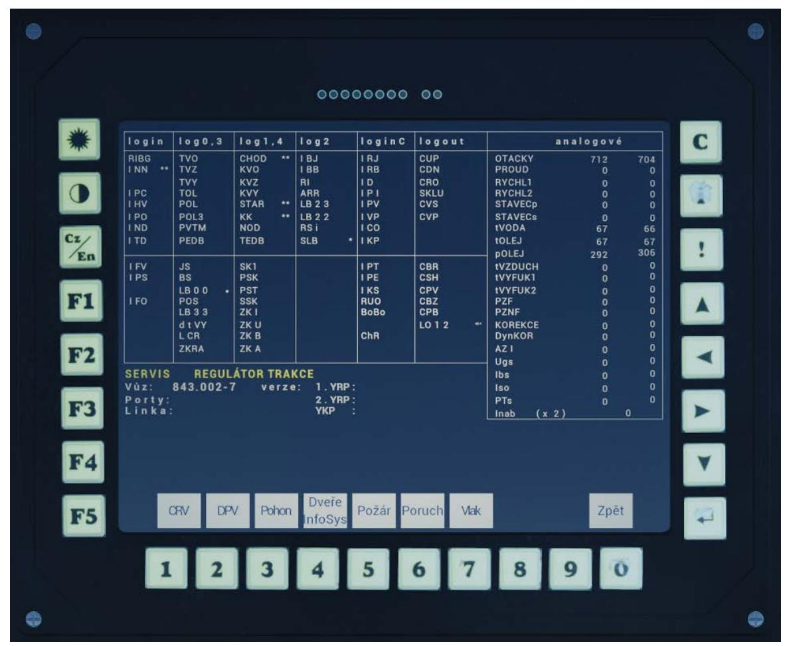

| RIBG | Field contactor active KM160 / KM260          | INN  | Utrals KR114 / KR214               |
|------|--------------------------------------------------|------|------------------------------------|
| IPC  | Water pump failure, stop                         | IHV  | Low water or low rpm, stop         |
| IPO  | Low oil pressure (0.6bar<)                    | IND  | High rpm (>2100), stop             |
| ITD  | High temp (>105°C water, >125°C oil), neutral | IFV  | Full air intake                    |
| IPS  | Start contactor broken                           | IFO  | Full oil filter                    |
| TVO  | Water temp > 105°C, neutral                   | TVZ  | Air intake temp > 95°C, neutral |
| TVY  | Air exhaust temp > 700°C, neutral             | TOL  | Oil temp >125°C, neutral           |
| POL  | Oil press <0.6bar, stop                          | POL3 | Oil press < 1bar, neutral          |
| PVTM | Traction engine ventilation failure, neutral  | PEDB | reserved                           |
| JS   | True drive (contactors ok)                       | BS   | True brake (contactors ok)         |
| LB00 | EDB current <50A                                 | POS3 | Eng. governor failure              |
| LB33 | Internal error                                   | dtVY | Exhaust temp deviation >70°C    |
| LCR  | CRV bus                                          | ZKRA |                                    |
| CHOD | RPM > 400                                        | KVO  | Water t power correction           |
| KVZ  | Air intake t power correction                 | KVY  | Air exhaust t power correction  |

| STAR     | RPM > 600 for more than 6s     | KK           | Internal communication               |
|----------|-----------------------------------|--------------|--------------------------------------|
| NOD      | RPM < 530, stop                   | TEDB         | EDB thermal protection               |
| SK1      | Wheelslip or skid                 | PSK          | Wheelslip of inactive bogie          |
| PST      | reserved                          | SSK          | Wheelslip                            |
| ZKI      | Itr > 1kA for more than 3s        | ZKU          | Ugs > 1kV for more than 3s           |
| ZKB      | Ibs > 470A for more than 3s    | ZKA          | Azi > 4000 for more than 3s          |
| IBJ      | Int. reg. state drive             | IBB          | Int. reg. state brake                |
| RI       | Regulation current/voltage     | ARR          | ARR active                           |
| LB23     | Internal comm. error              | LB22         | Internal comm. error                 |
| RSi      | Internal bus                      | SLB          | Internal bus                         |
| IRJ      | GM15 drive                        | IBB          | GM15 brake                           |
| ID       | GM15 diesel                       | IPI          | Isolation failure                    |
| IPV      | V > 115km/h, neutral              | ICO          | Wrong manipulation BoBo              |
| IKP      | Compressor running                | IPT          | GM15 connected                       |
| IPE      | EDB overload, neutral             | IKS          |                                      |
| RUO      | KM3 contactor set                 | BoBo         | BoBo mode active                     |
| ChR      | Forced engine cooling             | CUP          | Governor going up                    |
| CDN      | Governor going down               | CRO          | Engine cooling active                |
| SKLU     | Wheelslip indication              | CVS          | Serial traction engine cooling       |
| CVP      | Parallel traction engine cool. | CBR          | Brake resistor connected             |
| CSH      | Field divert active               | CPV          | Traction engine ventilation fail. |
| CBZ      | EDB active                        | CPB          | reserved                             |
| LO12     | 1s timestamps control             | OTÁČKY       | Engine RPM                           |
| PROUD    | Bogie current                     | RYCHL1       | Axle 1,3 speed                       |
| RYCHL2   | Axle 2,4 speed                    | STAVĚČC p | Requested governor position          |
| STAVĚČCs | True governor position            | tVODA        | Water temperature                    |
| tOLEJ    | Oil temperature                   | pOLEJ        | Oil pressure                         |
| tVZDUCH  | Intake air temperature            | tVÝFUK1      | Exhaust temperature                  |
| tVÝFUK2  | Exhaust temperature               | PZF          | Requested reg. power in kW           |
| PZNF     | Requested eng. power in kW     | KOREKC E  | Power correction                     |
| DynKOR   | Dyn. correction                   | AZI          | Generator field open ratio           |
| Ugs      | Generator voltage                 | Ibs          | Field current in brake               |
| Iso      | Bogie current deviation           | PTs          | True set power                       |

### **Poruch - Failure history**

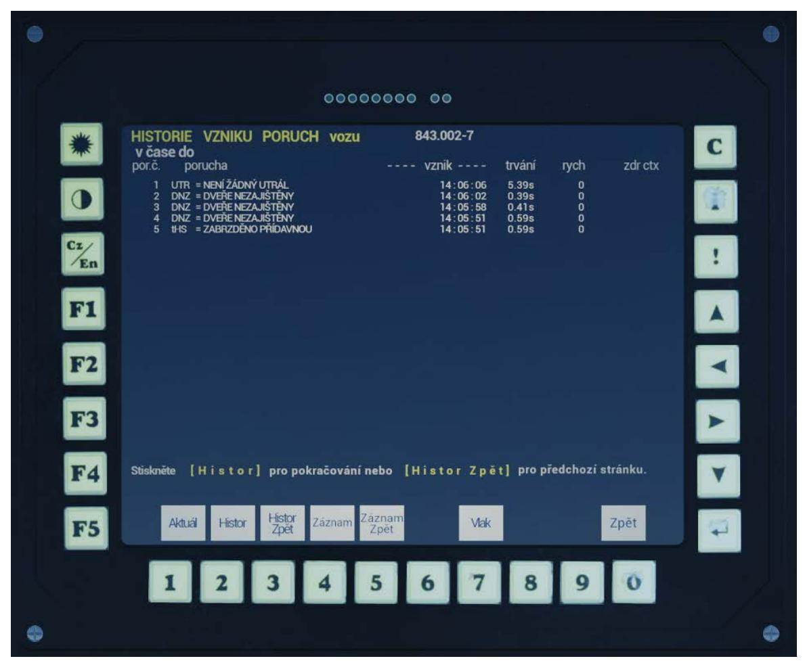

The history of all failures is located here. If any failure has **"trvá\*"** in the column **"trvání"**, it means that it is still active and the fault still affects the train.

**Vlak - Consist information**

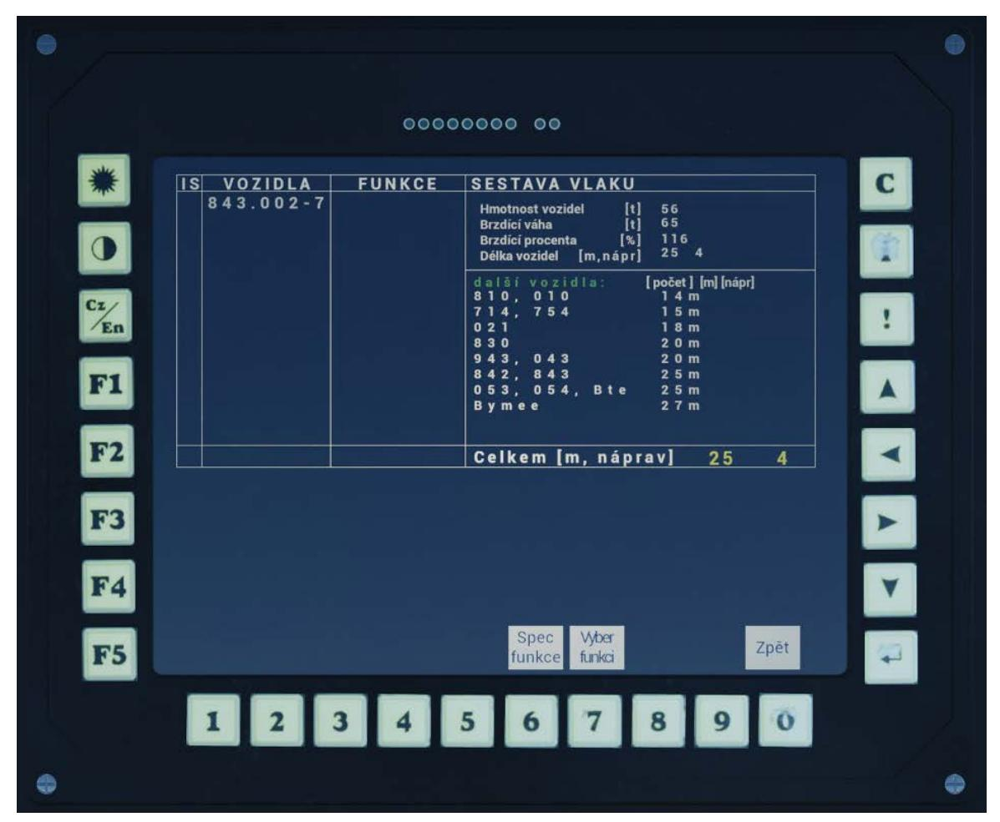

Information about the current connected consist can be found here. This page shows UIC numbers of all vehicles, total consist weight, braking weight, braking percent and length in meters and axles.

### **ISC - Infosystem controls**

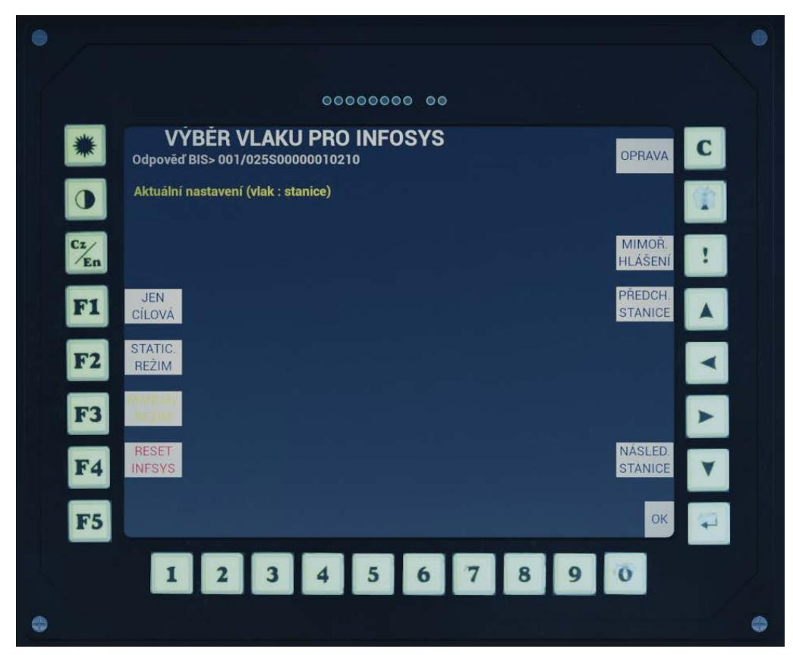

The empty page allows the driver to input a new train number to the announcement system. The system would then try to load a timetable for that train after pressing the Enter key. Corrections to the number can be made using the C key.

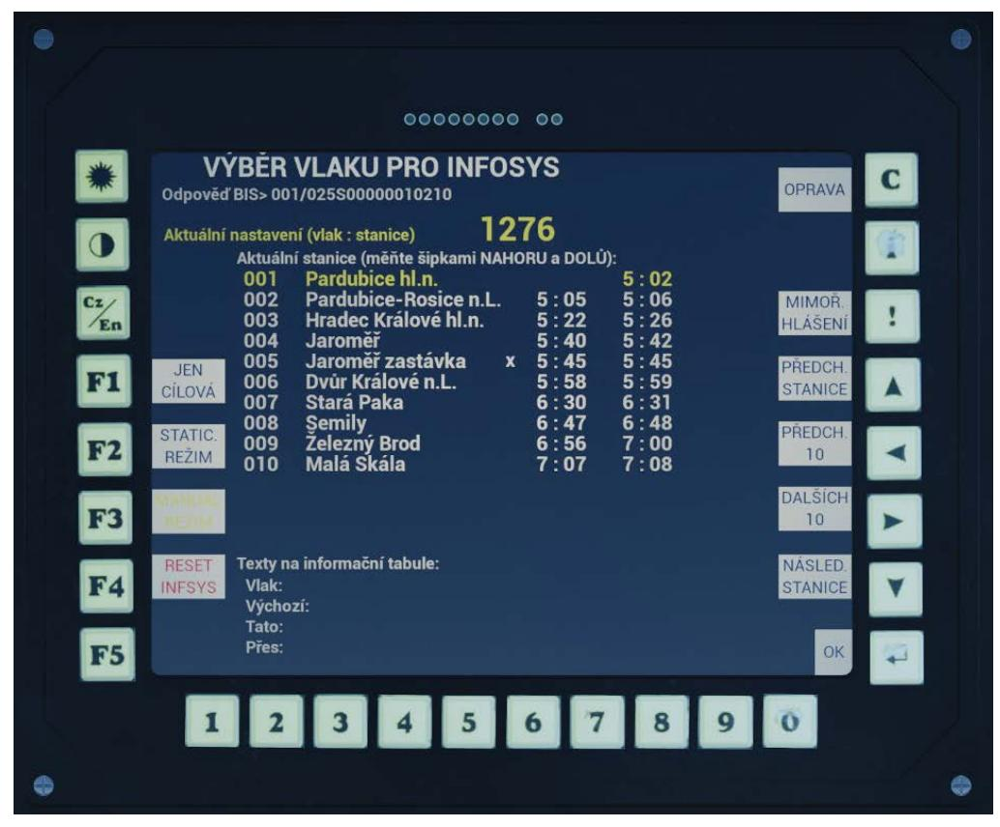

Now displays show train 1276 and its stops. Here, the driver selects the current station (currently it is the highlighted yellow row Pardubice hl.n.). By pressing Up, Left, Right and Down keys, it is possible to shift the selection in increments of 1 or 10. Press the Enter key after selecting the correct station. The infosystem will now display correct data on the displays and play announcements.

The infosystem uses GPS positions to play announcements and shift to the next station after departing.

Currently, it uses 750m/400m distances to trigger incoming announcement while approaching the station/stop and 500m/200m distances to trigger a shift to the next station.

# **List of breakers**

| Breakers in cab A            |                                                                                                                      |                                 |                                           |
|---------------------------------------|----------------------------------------------------------------------------------------------------------------------|---------------------------------|-------------------------------------------|
| Řízení                                | Linked to the cab activation and central computer, turn off and on after pressing the emergency engine stop | Řídící počítač               | Central computer breaker                  |
| EP Ventily                            | Electropneumatic valves of mirrors, wheel lubrication, etc.                                                    | Brzdiče                         | Brake controls                            |
| Přídavná brzda                     | Direct brake                                                                                                         | Rychlobrzd a                 | Emergency brake electropneumatic valve |
| VZ                                    | Safety system                                                                                                        | Tachograf                       | Speedometer                               |
| Protismyk                             | Antislip                                                                                                             | Požární zařízení             | Fire extinguishing system                 |
| Zásuvka 48V, Vařič, Bojler      | Disconnected                                                                                                         | Ohřev skel                      | Window heating                            |
| Vozový rozhlas                     | Disconnected                                                                                                         | Informační systém            | Passenger infosystem                      |
| Signalizac e vozy                  | Disconnected                                                                                                         | Stěrače, Omývače             | Wipers                                    |
| Blok řízení WC                     | Disconnected                                                                                                         | Chladnička, nouz. osvětl. | Backup lighting                           |
| Breakers on the RTR panel |                                                                                                                      |                                 |                                           |
| FA 103                                | Field exciter 1                                                                                                      | FA 203                          | Field exciter 2                           |
| FA 104                                | Governor engine 1                                                                                                    | FA 204                          | Governor engine 2                         |
| FA 20                                 | Control circuits 1                                                                                                   | FA 21                           | Control circuits 2                        |
| FA 24                                 | Regulator                                                                                                            | FA 25                           | Analogue regulator                        |
| FA 30                                 | Disconnected                                                                                                         | FA 26                           | Charging                                  |
| FA 171                                | Traction engine ventilation 1                                                                                     | FA 172                          | Traction engine ventilation 2             |
| FA 271                                | Traction engine ventilation 3                                                                                     | FA 272                          | Traction engine ventilation 4             |

# **RTR Panel**

**SV 6 Input signals switch** - disables input signals into the regulator, which will create a traction lock.

**SV 7 Drive mode switch** - default position is **Bo**. This way, both engines power one bogie each. The **BoBo** position will allow one engine to power both bogies. This manipulation would, however, make the voltage overshoot the maximum rated value, so setting the switch to the BoBo position with both engines running would cause the **ICO** failure message to appear and immediately block both traction and electrodynamic braking. The BoBo mode is useful if only one diesel engine can be used, but both bogies need to be powered if the adhesion is really low. It is also useful if the backup regulator mode is used, and only one engine is running, as it lowers the probability of a wheelslip.

**SV 8 Backup regulator** - in cases of some unresolvable regulator faults, the backup can help to investigate the state or at least let the driver get the train to the depot for needed maintenance.

There are some big differences on how the vehicle handles in this mode.

- The set power won't be displayed on the main screen
- Some protections are unavailable, and some fault conditions won't be checked
- The holding brake can be released only by applying the direct brake and increasing the brake cylinder pressure past the pressure of the holding brake
- The generators are excited from batteries only with static voltage. This means that the train would apply a big tractive force at low speeds, but that would rapidly drop down.
- Field diversion isn't active in this mode, so the **speed shouldn't exceed 80 km/h**.

**SA 51 Engine cooling** - position 1 will force the engine cooling system to cool at its maximum capacity at all times. Normally, the engine cooling system tries to keep the temperature near a certain value. It, however, means that the cooling system engages gradually, and won't attempt to utilise the maximum cooling capacity until this temperature is significantly overshoot. Engaging this mode in hot weather can cool engines below their intended temperature when running on relatively flat terrain or even descending, and thus delay engines from overheating on sustained steep inclines. Misusing it in cold weather can, however, make the engine run at very low temperatures and make its lubrication ineffective. Use with caution.

For circuit breakers description, look into the *List of breakers* chapter.

# **Failures List**

Here is a list of all defined failures in Class 843. However, most of these failures won't ever happen. Some of the failures can randomly appear and disappear without meaning anything wrong.

| Code IND1 Too high RPM of engine 1, engine stops IND2 Too high RPM of engine 2, engine stops IPO1 Low oil pressure of engine 1, engine stops IPO2 Low oil pressure of engine 2, engine stops IHV1 Low water level or too low RPM of engine 1, engine stops IHV2 Low water level or too low RPM of engine 2, engine stops IPE Electrodynamic brake overload TVO1 Water temp > 105°C on engine 1 TVO2 Water temp > 105°C on engine 2 IPV Exceeded max speed, neutral tRzS Failure on the slave vehicle tRZv Failure on the slave vehicle KOLm Local collision of active cabs KOL Consist collision of active cabs DOB The battery is not being charged DNZ Doors not closed Rucb The local handbrake is not loose UTR No utral (all engines are in neutral) Vp0 ARR is active, but the set speed is 0 km/h DNZv Consist doors not closed RucBv Consist handbrake is not loose KVO1 Power correction from the water temperature of engine 1 KVO2 Power correction from the water temperature of engine 2 SKL1 Wheelslip bogie 1 SKL2 Wheelslip bogie 2 |
|-----------------------------------------------------------------------------------------------------------------------------------------------------------------------------------------------------------------------------------------------------------------------------------------------------------------------------------------------------------------------------------------------------------------------------------------------------------------------------------------------------------------------------------------------------------------------------------------------------------------------------------------------------------------------------------------------------------------------------------------------------------------------------------------------------------------------------------------------------------------------------------------------------------------------------------------------------------------------------------------------------------------------------------------------------------------------------------------------------------------------------------------------------------------------------------------------------------|
|                                                                                                                                                                                                                                                                                                                                                                                                                                                                                                                                                                                                                                                                                                                                                                                                                                                                                                                                                                                                                                                                                                                                                                                                           |
|                                                                                                                                                                                                                                                                                                                                                                                                                                                                                                                                                                                                                                                                                                                                                                                                                                                                                                                                                                                                                                                                                                                                                                                                           |
|                                                                                                                                                                                                                                                                                                                                                                                                                                                                                                                                                                                                                                                                                                                                                                                                                                                                                                                                                                                                                                                                                                                                                                                                           |
|                                                                                                                                                                                                                                                                                                                                                                                                                                                                                                                                                                                                                                                                                                                                                                                                                                                                                                                                                                                                                                                                                                                                                                                                           |
|                                                                                                                                                                                                                                                                                                                                                                                                                                                                                                                                                                                                                                                                                                                                                                                                                                                                                                                                                                                                                                                                                                                                                                                                           |
|                                                                                                                                                                                                                                                                                                                                                                                                                                                                                                                                                                                                                                                                                                                                                                                                                                                                                                                                                                                                                                                                                                                                                                                                           |
|                                                                                                                                                                                                                                                                                                                                                                                                                                                                                                                                                                                                                                                                                                                                                                                                                                                                                                                                                                                                                                                                                                                                                                                                           |
|                                                                                                                                                                                                                                                                                                                                                                                                                                                                                                                                                                                                                                                                                                                                                                                                                                                                                                                                                                                                                                                                                                                                                                                                           |
|                                                                                                                                                                                                                                                                                                                                                                                                                                                                                                                                                                                                                                                                                                                                                                                                                                                                                                                                                                                                                                                                                                                                                                                                           |
|                                                                                                                                                                                                                                                                                                                                                                                                                                                                                                                                                                                                                                                                                                                                                                                                                                                                                                                                                                                                                                                                                                                                                                                                           |
|                                                                                                                                                                                                                                                                                                                                                                                                                                                                                                                                                                                                                                                                                                                                                                                                                                                                                                                                                                                                                                                                                                                                                                                                           |
|                                                                                                                                                                                                                                                                                                                                                                                                                                                                                                                                                                                                                                                                                                                                                                                                                                                                                                                                                                                                                                                                                                                                                                                                           |
|                                                                                                                                                                                                                                                                                                                                                                                                                                                                                                                                                                                                                                                                                                                                                                                                                                                                                                                                                                                                                                                                                                                                                                                                           |
|                                                                                                                                                                                                                                                                                                                                                                                                                                                                                                                                                                                                                                                                                                                                                                                                                                                                                                                                                                                                                                                                                                                                                                                                           |
|                                                                                                                                                                                                                                                                                                                                                                                                                                                                                                                                                                                                                                                                                                                                                                                                                                                                                                                                                                                                                                                                                                                                                                                                           |
|                                                                                                                                                                                                                                                                                                                                                                                                                                                                                                                                                                                                                                                                                                                                                                                                                                                                                                                                                                                                                                                                                                                                                                                                           |
|                                                                                                                                                                                                                                                                                                                                                                                                                                                                                                                                                                                                                                                                                                                                                                                                                                                                                                                                                                                                                                                                                                                                                                                                           |
|                                                                                                                                                                                                                                                                                                                                                                                                                                                                                                                                                                                                                                                                                                                                                                                                                                                                                                                                                                                                                                                                                                                                                                                                           |
|                                                                                                                                                                                                                                                                                                                                                                                                                                                                                                                                                                                                                                                                                                                                                                                                                                                                                                                                                                                                                                                                                                                                                                                                           |
|                                                                                                                                                                                                                                                                                                                                                                                                                                                                                                                                                                                                                                                                                                                                                                                                                                                                                                                                                                                                                                                                                                                                                                                                           |
|                                                                                                                                                                                                                                                                                                                                                                                                                                                                                                                                                                                                                                                                                                                                                                                                                                                                                                                                                                                                                                                                                                                                                                                                           |
|                                                                                                                                                                                                                                                                                                                                                                                                                                                                                                                                                                                                                                                                                                                                                                                                                                                                                                                                                                                                                                                                                                                                                                                                           |
|                                                                                                                                                                                                                                                                                                                                                                                                                                                                                                                                                                                                                                                                                                                                                                                                                                                                                                                                                                                                                                                                                                                                                                                                           |
|                                                                                                                                                                                                                                                                                                                                                                                                                                                                                                                                                                                                                                                                                                                                                                                                                                                                                                                                                                                                                                                                                                                                                                                                           |
|                                                                                                                                                                                                                                                                                                                                                                                                                                                                                                                                                                                                                                                                                                                                                                                                                                                                                                                                                                                                                                                                                                                                                                                                           |
| tAS Too low pressure in the brake pipe                                                                                                                                                                                                                                                                                                                                                                                                                                                                                                                                                                                                                                                                                                                                                                                                                                                                                                                                                                                                                                                                                                                                                                 |
| tBCS Low pressure in brake pipe, output pressure from distributor > 0 bar                                                                                                                                                                                                                                                                                                                                                                                                                                                                                                                                                                                                                                                                                                                                                                                                                                                                                                                                                                                                                                                                                                                              |
| tHS Loco brake is applied (BPE)                                                                                                                                                                                                                                                                                                                                                                                                                                                                                                                                                                                                                                                                                                                                                                                                                                                                                                                                                                                                                                                                                                                                                                        |
| SMER No direction of travel is set                                                                                                                                                                                                                                                                                                                                                                                                                                                                                                                                                                                                                                                                                                                                                                                                                                                                                                                                                                                                                                                                                                                                                                     |
| kUIC New consist information loaded, confirm by opening VLAK page                                                                                                                                                                                                                                                                                                                                                                                                                                                                                                                                                                                                                                                                                                                                                                                                                                                                                                                                                                                                                                                                                                                                      |
| LB01 Dynamic brake power too low/zero                                                                                                                                                                                                                                                                                                                                                                                                                                                                                                                                                                                                                                                                                                                                                                                                                                                                                                                                                                                                                                                                                                                                                                  |
| LB02 Dynamic brake power too low/zero                                                                                                                                                                                                                                                                                                                                                                                                                                                                                                                                                                                                                                                                                                                                                                                                                                                                                                                                                                                                                                                                                                                                                                  |
| IBJ1 Drive conditions not met, internal failure                                                                                                                                                                                                                                                                                                                                                                                                                                                                                                                                                                                                                                                                                                                                                                                                                                                                                                                                                                                                                                                                                                                                                        |
| IBJ2 Drive conditions not met, internal failure                                                                                                                                                                                                                                                                                                                                                                                                                                                                                                                                                                                                                                                                                                                                                                                                                                                                                                                                                                                                                                                                                                                                                        |
| RIB1 The field contactor not closed                                                                                                                                                                                                                                                                                                                                                                                                                                                                                                                                                                                                                                                                                                                                                                                                                                                                                                                                                                                                                                                                                                                                                                    |
| RIB2 The field contactor not closed                                                                                                                                                                                                                                                                                                                                                                                                                                                                                                                                                                                                                                                                                                                                                                                                                                                                                                                                                                                                                                                                                                                                                                    |
| ZKA1 Requested traction current > 800A                                                                                                                                                                                                                                                                                                                                                                                                                                                                                                                                                                                                                                                                                                                                                                                                                                                                                                                                                                                                                                                                                                                                                                 |
| ZKA2 Requested traction current > 800A                                                                                                                                                                                                                                                                                                                                                                                                                                                                                                                                                                                                                                                                                                                                                                                                                                                                                                                                                                                                                                                                                                                                                                 |
| dISO High difference in isolation state between bogie 1 and 2                                                                                                                                                                                                                                                                                                                                                                                                                                                                                                                                                                                                                                                                                                                                                                                                                                                                                                                                                                                                                                                                                                                                          |
| ZKI1 Shortcircuit in bogie 1 circuit                                                                                                                                                                                                                                                                                                                                                                                                                                                                                                                                                                                                                                                                                                                                                                                                                                                                                                                                                                                                                                                                                                                                                                   |
| ZKI2 Shortcircuit in bogie 2 circuit                                                                                                                                                                                                                                                                                                                                                                                                                                                                                                                                                                                                                                                                                                                                                                                                                                                                                                                                                                                                                                                                                                                                                                   |
| ZKU1 Overvoltage on generator 1                                                                                                                                                                                                                                                                                                                                                                                                                                                                                                                                                                                                                                                                                                                                                                                                                                                                                                                                                                                                                                                                                                                                                                        |
| ZKU2 Overvoltage on generator 2                                                                                                                                                                                                                                                                                                                                                                                                                                                                                                                                                                                                                                                                                                                                                                                                                                                                                                                                                                                                                                                                                                                                                                        |

| PO31 Correction from oil pressure on engine 1 PO32 Correction from oil pressure on engine 2 TOL1 Oil temperature > 125°C on engine 1 TOL2 Oil temperature > 125°C on engine 2 ICO Wrong manipulation (BoBo selected, but both engines running) IPC2 Isolation failure ZNZ Requested stop on request SGC Air suspension failure KVZ1 Correction from the air intake temperature KVZ2 Correction from the air intake temperature IFV1 The air filter on engine 1 is full IFV2 The air filter on engine 2 is full Dev Fire extinguishing system failure in consist SGCv Air suspension failure in consist Dov Battery charging failure in consist Dvv Door failure in consist PTv Antislip device failure in consist Zev Grounding failure in consist ZemS Grounding failure local Dms Incorrect state of doors WC Toilet failure DgL Diagnostics failure |  |
|-----------------------------------------------------------------------------------------------------------------------------------------------------------------------------------------------------------------------------------------------------------------------------------------------------------------------------------------------------------------------------------------------------------------------------------------------------------------------------------------------------------------------------------------------------------------------------------------------------------------------------------------------------------------------------------------------------------------------------------------------------------------------------------------------------------------------------------------------------------------------------------------------------------------------------------------------------------------------------------------|--|
|                                                                                                                                                                                                                                                                                                                                                                                                                                                                                                                                                                                                                                                                                                                                                                                                                                                                                                                                                                                         |  |
|                                                                                                                                                                                                                                                                                                                                                                                                                                                                                                                                                                                                                                                                                                                                                                                                                                                                                                                                                                                         |  |
|                                                                                                                                                                                                                                                                                                                                                                                                                                                                                                                                                                                                                                                                                                                                                                                                                                                                                                                                                                                         |  |
|                                                                                                                                                                                                                                                                                                                                                                                                                                                                                                                                                                                                                                                                                                                                                                                                                                                                                                                                                                                         |  |
|                                                                                                                                                                                                                                                                                                                                                                                                                                                                                                                                                                                                                                                                                                                                                                                                                                                                                                                                                                                         |  |
|                                                                                                                                                                                                                                                                                                                                                                                                                                                                                                                                                                                                                                                                                                                                                                                                                                                                                                                                                                                         |  |
|                                                                                                                                                                                                                                                                                                                                                                                                                                                                                                                                                                                                                                                                                                                                                                                                                                                                                                                                                                                         |  |
|                                                                                                                                                                                                                                                                                                                                                                                                                                                                                                                                                                                                                                                                                                                                                                                                                                                                                                                                                                                         |  |
|                                                                                                                                                                                                                                                                                                                                                                                                                                                                                                                                                                                                                                                                                                                                                                                                                                                                                                                                                                                         |  |
|                                                                                                                                                                                                                                                                                                                                                                                                                                                                                                                                                                                                                                                                                                                                                                                                                                                                                                                                                                                         |  |
|                                                                                                                                                                                                                                                                                                                                                                                                                                                                                                                                                                                                                                                                                                                                                                                                                                                                                                                                                                                         |  |
|                                                                                                                                                                                                                                                                                                                                                                                                                                                                                                                                                                                                                                                                                                                                                                                                                                                                                                                                                                                         |  |
|                                                                                                                                                                                                                                                                                                                                                                                                                                                                                                                                                                                                                                                                                                                                                                                                                                                                                                                                                                                         |  |
|                                                                                                                                                                                                                                                                                                                                                                                                                                                                                                                                                                                                                                                                                                                                                                                                                                                                                                                                                                                         |  |
|                                                                                                                                                                                                                                                                                                                                                                                                                                                                                                                                                                                                                                                                                                                                                                                                                                                                                                                                                                                         |  |
|                                                                                                                                                                                                                                                                                                                                                                                                                                                                                                                                                                                                                                                                                                                                                                                                                                                                                                                                                                                         |  |
|                                                                                                                                                                                                                                                                                                                                                                                                                                                                                                                                                                                                                                                                                                                                                                                                                                                                                                                                                                                         |  |
|                                                                                                                                                                                                                                                                                                                                                                                                                                                                                                                                                                                                                                                                                                                                                                                                                                                                                                                                                                                         |  |
|                                                                                                                                                                                                                                                                                                                                                                                                                                                                                                                                                                                                                                                                                                                                                                                                                                                                                                                                                                                         |  |
|                                                                                                                                                                                                                                                                                                                                                                                                                                                                                                                                                                                                                                                                                                                                                                                                                                                                                                                                                                                         |  |
|                                                                                                                                                                                                                                                                                                                                                                                                                                                                                                                                                                                                                                                                                                                                                                                                                                                                                                                                                                                         |  |
|                                                                                                                                                                                                                                                                                                                                                                                                                                                                                                                                                                                                                                                                                                                                                                                                                                                                                                                                                                                         |  |

## **Driving notes**

- Class 843 can sometimes randomly drop the set power to 0%. This isn't any in-game bug but a simulation of a real-world "bug". If it happens in the MAN mode, simply add power again. ARR mode should automatically resume power if this happens. This tends to happen more often after a big change in the set power - e.g. going from 0% to 100% all at once. You can see the traction current dropping on one of the bogies a few seconds before this happens. Most of the time (but not always), the drop can be mitigated by changing the set power after the sudden current drop happens.
- If you need more efficient cooling, try setting the reverser to the Engine-Only notch and revving the engine up to around 1200-1400 rpm. This way, the cooling circuit will get more power and cool down the engines a bit faster. It is possible to do this manipulation while driving if you don't need to apply power or brake anytime soon. The winter mode of ARR does this "rev up" automatically in the Engine Only notch.
- The electrodynamic brake can sometimes fail. This is realistic behaviour, and it is necessary to have this in mind when braking, most importantly when approaching any stop signals.

# **Credits**

### **The Vector Simulations (V-Sim) team**

Dominik Chaloupka Matěj Kachlík David Javůrek Jakub Novák Vojtěch Raim Alexandr Szöllos Jiří Mrázek

### **Technical assistance**

Josef Kudláček Matyáš Fritsch Vojtěch Čáp Tomáš Pospíšil Daniel Marek Jaroslav Küfner Lukáš Zima and many others…

Big thank you also belongs to the Dovetail Games team for their help during the development.

# **Licences**

©2026 Developed by Vector Simulations CZ. Published by Dovetail Games. Dovetail Games is a trading name of RailSimulator.com Limited ("DTG"). "Train Sim World" and "SimuGraph" are trademarks or registered trademarks of DTG. Unreal® is a registered trademark or trademark of Epic Games, Inc. in the United States of America and elsewhere. Unreal® Engine, Copyright 1998 – 2026, Epic Games, Inc. All rights reserved. Portions of this software utilise SpeedTree® technology (©2014 Interactive Data Visualization, Inc.). SpeedTree® is a registered trademark of Interactive Data Visualization, Inc. All rights reserved. All rights reserved. Unauthorised copying, adaptation, rental, re-sale, arcade use, charging for use, broadcast, cable transmission, public performance, distribution or extraction of the product or any trademark or copyright work that forms part of this product is prohibited. All rights reserved.